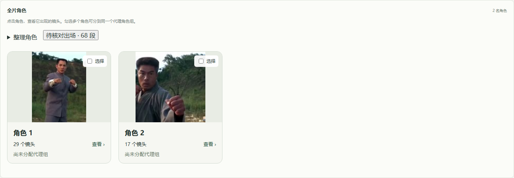
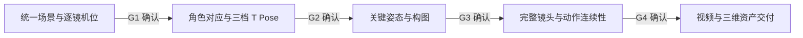

# MotionStage

**以原视频为参照，专注相机与角色动作还原的 Three.js 白模工作台。**

导入视频后汇总全片人物，按用户标记分为代理角色组，再核对相机和动作并导出三维资产。可见场景为可选分支。MotionStage 面向构图、角色走位、摄影机和动作衔接的核对，使用白模场景与彩色简化小人表达画面。

当前主页是混剪项目工作台，支持导入自己的视频、全片角色卡片、按角色查看出场镜头、代理角色分组，以及项目设置和删除。产品名为 MotionStage，GitHub 仓库名仍为 NexArtMS。JWM 样片的场景工作台和流程演练作为独立入口保留。

> **当前状态：可运行、需人工核对的原型。** 已具备素材分析、人物分组、近似动作与 GLB 交付管线；完整三维代理视频渲染、可见场景制作以及真实混剪数据的精度验收仍未完成。流程演练不代表正式验收通过。

角色卡交互与当前视频实测见[角色卡片修正](docs/role-cards-followup.md)。最新功能与 review 证据见[项目管理与人物分组复核](docs/review-projects-and-people.md)。[需求规格](docs/mixed-cut-workflow.md)、[开发计划与验收标准](docs/development-plan-mixed-cut.md)、[模型决策](docs/model-decisions.md)记录完整范围。



## 角色卡片与代理分组

界面默认展示全片的素材角色。例如已知视频中有两名角色时，在“整理角色”填写人数 `2`，整理后展示两张角色卡；镜内轨迹片段放在角色详情中。

1. **整理角色**：检测人物后，按外观线索汇总出场；可提供已知角色数，新项目默认未知。
2. **点击查看镜头**：每张卡显示角色名称、代表图、出场镜头数和代理组。点击后才展开去重镜头列表，再进入具体片段修正归属。
3. **核对不确定出场**：无法确定归属的片段集中在“待核对出场”，可选中并归入已有角色。
4. **建立代理组**：勾选一个或多个素材角色，分配到同一个代理组；它们共享一个代理角色资产，各自的出场动作保留。
5. **确认映射**：处理全部有效出场、解决同镜冲突后，正式确认角色映射，再核对相机、动作并导出。

例如素材中的甲、乙被指定为成片中的同一个人，可以把两张角色卡都分到“主角”组。界面仍保留两张素材角色卡以便核对，交付包为该组导出一个共享 GLB，包含各段有效动作。修正出场归属时会同步目标代理组，并清除已失效的动作引用。

人物汇总目前使用外观颜色线索，结果需要人工核对；填写人数不能保证所有镜头都被正确归属。完整三维代理视频渲染仍待实现。

## 快速开始

需要 **Node.js 22.12 或以上版本**、npm，以及可在命令行调用的 **FFmpeg / ffprobe**；本项目在 Node.js 22.22.3 上验证。浏览器需要支持 WebGL。界面为响应式布局，桌面与窄屏/移动端宽度均可使用。

```sh
git clone https://github.com/yaopengcheng11/NexArtMS.git
cd NexArtMS
npm ci
npm run build
npm run serve
```

打开 <http://127.0.0.1:8199/>。服务仅监听本机，终端关闭后服务停止。

| 页面 | 地址 | 用途 |
|---|---|---|
| 混剪项目（主页） | <http://127.0.0.1:8199/> | 新建项目、导入自己的视频：切镜、出场候选、角色归并与确认 |
| 场景工作台（JWM 样片） | <http://127.0.0.1:8199/?mode=scene> | 查看统一空场景、逐镜对照、保存位置和意见 |
| 五阶段演练 | <http://127.0.0.1:8199/?mode=rehearsal> | 从场景确认走到交付预览，体验每一步的通过操作 |
| 刚性角色试验 | <http://127.0.0.1:8199/?lab=rig> | 查看 CL0／CL1／CL2、合成姿态及 GLB 导出 |

仓库已带样片、参考帧和技术模型。浏览现有样例不需要 API Key、即梦 CLI、姿态检测模型或外部生成服务，也不需要再次抽帧。首次启动会从 `public/project/` 创建 JWM 样例的本地场景数据；混剪项目从项目列表创建。

混剪项目工作台需要本机安装 **FFmpeg**（在 PATH 中，或设置 `FFMPEG`/`FFPROBE` 环境变量）。上传自己的视频时，首版输入范围为：MP4/MOV、H.264/H.265、最长 120 秒、最高 1080p；可用 `STUDIO_MAX_UPLOAD_MB`、`STUDIO_MAX_DURATION_S`、`STUDIO_MAX_WIDTH_PX`、`STUDIO_MAX_HEIGHT_PX` 调整。超出范围会得到明确原因与预处理建议。

### 启用自动人物检测

```sh
node scripts/fetch-detector-model.mjs
```

下载完成后重启 `npm run serve`。权重保存在 `data/models/`，使用随 npm 安装的可选依赖 `onnxruntime-node` 在本机推理；权重未随仓库分发。模型来源、哈希与许可记录见[模型决策](docs/model-decisions.md)。未安装或无法加载模型时，人物检测任务会明确失败；人工补标仍可使用。

## 混剪项目工作台

当前流程：**导入视频 → 切镜与人物检测 → 核对角色卡片及出场 → 分配代理组 → 正式确认映射 → 核对相机与动作 → 导出资产包**。可见场景是可选分支。

- **多项目与媒体（M1）**：每个项目有独立目录 `data/projects/<id>/{media,proxies,observations,previews,exports}`；原片只读保存并记录 SHA-256；ffprobe 探测时长、尺寸、旋转与帧率；逐呈现帧生成 PTS 时间戳映射（可变帧率按实际时间戳，不按固定帧率推算）；后台任务依次生成可播放代理、PTS 映射与自动切镜，任务支持进度、取消、重试，服务重启后中断任务如实标记失败。元数据存于 `data/studio.sqlite3`（SQLite WAL）。
- **切镜与出场候选（M2）**：自动切镜基于相邻呈现帧直方图距离（JWM 替身集召回 100%、精确率 83.6%，见 `reports/baseline-mixed-cut.json`）；单帧闪白抑制；人工改切点要求覆盖全部帧且无缝。人物检测/姿态用 YOLOv8n-pose（ONNX）：运行 `node scripts/fetch-detector-model.mjs` 下载权重（AGPL，见 [模型决策](docs/model-decisions.md)）并重启服务；未配置时 detect 任务如实失败。检测逐帧框经镜内 IoU 跟踪成为出场候选（约 10fps 采样 + COCO-17 关键点观测）；也可人工补标、拆分、连接、删除误检。跨切镜轨迹绝不自动连接。
- **相机与动作（M4/M5）**：有 ≥6 个米制三维地标时逐镜 PnP 求解相机（纯 JS DLT+高斯牛顿，A5 门槛：中位重投影 ≤8px 为高置信）；证据不足只能人物框粗估并强制"待人工确认"。动作把二维姿态提升为固定骨长三维关节（骨长偏差由构造 ≤0.1%，A6），输出 y 向上、地面为 0 的角色局部坐标系动作与接触标注；单目深度歧义不消除，需人工逐镜审查。
- **交付（M6）**：一键导出交付包——manifest（含输入哈希与算法版本）、镜头时间表、角色与归并清单、相机轨迹、逐实例动作 JSON、每组一个共享 GLB 代理资产（包含组内各段有效出场动画）。预览视频渲染、可见场景资产（M4S）与 DCC 回读实测不在首版范围，manifest 中如实标注。
- **角色归并与确认（M3）**：创建成片角色资产（名称、颜色、身高、版本）；在“全片角色”勾选角色，批量绑定到代理角色组或明确忽略；不同人物同组时共享代理外观。外观相似汇总标为待核对，可人工标记、合并或拆开；同镜同角色同框会提示冲突，确属分身/镜像需在角色上明确允许。全部候选处理完毕后才允许正式确认——确认会冻结媒体哈希、切点、候选与归并版本；此后任何上游修改都会使确认自动失效并回退。
- **项目设置和删除**：工作台右上角“项目设置”可修改名称、说明、场景选项。删除须输入完整项目名，并等待上传、任务和文件读取结束；删除该项目的元数据、媒体及生成文件。数据库当前版本为 v5，已有数据库升级前自动生成备份。
- **旧项目的人物汇总**：展开“整理角色”，填写已知的片中角色数后点击“整理人物出场”；角色卡默认收起镜头，点击角色才查看所属镜头，未确定归属的片段集中在待核对入口；已核对/已分组的人工决定会保留。颜色线索无法证明真实身份，最终人物数量和叙事分组由用户核对。
- **与旧数据隔离**：混剪项目使用独立的数据库与目录；JWM 的 `data/project.json`、演练与正式确认流程不受影响。

写入语义与正式流程一致：所有修改携带 `baseRevision`，过期写入返回 409；未处理候选阻止正式确认并返回 422。API 一览见 [开发计划 §4](docs/development-plan-mixed-cut.md)。实机验收（导入 JWM 原片 → 切镜 → 真实检测 → 归并确认 → 动作 → 交付包）可用 `BASE_URL=http://127.0.0.1:8199 node scripts/acceptance-mixed-cut.mjs` 复跑，报告见 `reports/acceptance-mixed-cut.json`；浏览器冒烟用 `node scripts/browser-studio-probe.mjs`。

需要使用其他端口时，例如 macOS／Linux：

```sh
PORT=8200 npm run serve
```

不要直接双击 `index.html`；数据保存、视频读取和页面资源需要通过本地服务访问。

## JWM 样片：五阶段流程演练

以下内容属于内置样片的场景工作台与演练。上传自己的混剪视频请使用主页的混剪项目流程；相机和动作还原可选择不制作可见场景。



| 阶段 | 目标 | 当前可体验内容 |
|---|---|---|
| 1. 场景还原 | 在所有镜头中复用同一场景，先核对背景和机位 | 无角色的固定场景、47 个初步机位、自由观察、俯视、141 张原片首／中／尾参考帧 |
| 2. 角色确认 | 原片身份与三维角色一一对应，确认比例和 T Pose | P1／P2 身份参考与三档合成小人；正式 T Pose 图片尚未制作 |
| 3. 关键姿态 | 先确认逐镜关键帧，再制作完整动作 | 原片与旧版 V2 的 47 张中间帧并排样例 |
| 4. 完整镜头 | 检查连续动作、接触、镜头运动和剪辑节奏 | 原片与 V2 视频同步播放、并排、叠加、逐帧、切镜和倍速 |
| 5. 导出交付 | 导出视频，以及场景、角色、角色动画和相机动画 | 下载现有 V2 MP4 和合成角色 GLB／BLEND／FBX／USD 技术样例 |

### 怎样点击“通过”

在正式工作台底部，点击 **“演练通过 → 角色确认”**，可以假设对当前场景没有意见并进入第二步；也可以从顶部“流程演练”入口开始第一步。

之后使用每一步底部的继续按钮，直到“完成演练”。顶部步骤可回看已经到过的页面；刷新会恢复进度。完整视频对照位于第四步 **“完整镜头 → 连起来看一遍”**。

演练通过记录为 `demo_passed`，保存到独立文件。正式 G1 的“确认场景通过”仍受机位测量条件约束；演练通过不会替代正式验收。

## 场景与角色

### 一个场景，多台摄影机

- 所有镜头复用同一套地形、墓墙、围挡与树木。
- 支持自由旋转、缩放、平移、俯视，以及切换逐镜机位。
- 可修改地物位置、记录意见并保存版本；过期版本写入会被拒绝。
- 当前尺度以约 1.75 米人物身高为暂定参照；机位、纵深与不可见结构仍含估计。

### CL0／CL1／CL2 三档小人

| 档位 | 可见部件 | 表达内容 |
|---|---:|---|
| CL0 | 2 | 头与整体躯干，用于轮廓、重心和大动作沟通 |
| CL1 | 6 | 加入整段四肢，用于行走、转身和基础姿态 |
| CL2 | 27 | 分段四肢、关节和手脚，用于打斗及接触检查 |

技术样例共用 **22 个骨骼／控制节点**。部件随骨骼刚性运动，切换外观保留根位置和姿态；CL1 保持整段肢体长度。导出使用单骨 100% 权重表示，无需人工刷混合权重。

样片的身份约定为：橙色 P1 对应灰绿上衣、褐裤、白鞋角色；蓝色 P2 对应灰蓝衣、黑鞋角色。新流程中的正式角色比例与 T Pose 仍需确认。

## 原片与三维同步对照

第四步采用与项目一致的浅米白、灰绿和深绿界面。支持：

- **并排对照**：左侧三维，右侧原片，使用相同画幅和播放位置。
- **叠加对齐**：原片覆盖在三维画面上，可调整比例和打开三分参考线；0% 看三维，100% 看原片。
- **三维单看**：单独显示三维视频，切换模式保留播放位置。
- **47 镜时间线与镜头表**：随播放高亮，点击镜头跳到首帧。橙色为 P1 单人镜头，蓝色为 P2 单人，灰色为双人或其他镜头。
- **精确定位**：上一帧／下一帧、拖动帧进度、输入秒数、从头查看。
- **回放控制**：0.25×／0.5×／1×／1.5×／2×；只播放原片的一路声音。

| 操作 | 快捷键 |
|---|---|
| 播放／暂停 | 点击画面后按空格 |
| 上一镜／下一镜 | `←`／`→` |
| 上一帧／下一帧 | `Shift + ←`／`Shift + →` |

定位操作会暂停，点击播放继续；输入框内保留正常输入行为。界面帧号从 1 开始，数据帧号从 0 开始。

当前第四步播放的是已导出的 V2 MP4，两路视频共享同步控制器。实时三维与自由视角回放保存在 [`examples/jwm-v2/`](examples/jwm-v2/README.md)。叠加用于观察差异，不会自动修改场景或相机。

## 工程结构

```text
NexArtMS/
├── src/                       # React 页面、Three.js 场景、刚性角色、视频对照
│   ├── main.tsx               # 正式场景工作台
│   ├── Rehearsal.tsx          # 五阶段演练
│   ├── studio.tsx             # 混剪项目：导入、切镜、出场候选、角色归并
│   ├── StudioPeople.tsx       # 全片角色卡、出场核对、代理组与项目设置
│   ├── SceneViewport.tsx      # 三维视图与机位切换
│   ├── environment.ts         # 固定场景
│   ├── rig.ts                 # 统一骨架与三档外观
│   ├── VideoComparison.tsx    # 对照播放器
│   └── comparison-clock.ts    # 两路视频同步、定位、缓冲
├── studio/                    # 混剪还原后端模块
│   ├── db.mjs                 # SQLite 元数据、版本冲突、状态机、归并领域逻辑
│   ├── project-operations.mjs # 项目设置/删除、角色归属与代理绑定
│   ├── media.mjs              # 流式上传、ffprobe/PTS、代理、缩略图
│   ├── cuts.mjs               # 自动切镜（纯函数）
│   ├── person.mjs             # 检测器接口与镜内跟踪（纯函数）
│   ├── people.mjs             # 外观描述与全片角色汇总
│   ├── vision.mjs             # YOLOv8n-pose ONNX 推理适配（可选依赖）
│   ├── camera.mjs             # DLT+高斯牛顿 PnP 相机求解（纯函数）
│   ├── pose3d.mjs             # 固定骨长 3D 提升、平滑、接触标注（纯函数）
│   ├── jobs.mjs               # 任务队列（proxy/pts/cuts/detect/people/motion/export）
│   └── router.mjs             # /api/studio/* 路由
├── public/
│   ├── project/               # 初始场景与镜头数据
│   ├── reference.mp4          # 原片对照视频
│   ├── reference-frames/      # 141 张精确参考帧
│   ├── demo/                  # V2 视频与 47 张中间帧
│   └── probes/                # 刚性角色与 DCC 格式技术样例
├── server.mjs                 # 本地 HTTP、数据接口、视频分段读取
├── project-store.mjs          # 正式项目保存与版本检查
├── rehearsal-store.mjs        # 独立演练记录与阶段推进
├── scripts/                   # 自动检查、浏览器检查、抽帧和 DCC 试验
├── examples/jwm-v2/           # 旧版实时预演源码与姿态数据
├── docs/                      # 实施方案与执行进度
└── reports/                   # 验证记录和界面截图
```

运行时生成的 `data/`、构建结果 `dist/` 和依赖 `node_modules/` 不纳入版本库。旧版示例的 `examples/jwm-v2/data/` 是重建姿态所需的输入数据，会随源码保存。

### 数据与版本

正式项目保存在 `data/project.json`，历史版本保存在 `data/revisions/`。演练保存在 `data/rehearsal.json` 与 `data/rehearsals/`。混剪项目的元数据保存在 `data/studio.sqlite3`，上传的视频与产物保存在 `data/projects/<projectId>/`。前端保存时携带基准版本；正式场景变更后，基于旧版本的演练需要重新开始。

仓库没有携带当前使用者的项目、模型权重或完成记录。新克隆从项目列表开始，内置场景使用初始样例。备份本地工作时需同时保留 `data/`（含混剪项目数据库与媒体）。

SQLite 当前 schema 为 **v5**；已有数据库升级前生成 `data/studio-before-v<版本>-<时间戳>.sqlite3`。项目人数提示、角色代理组和人工决定会持久保存，未归属出场在重启后仍保持待核对。数据库备份不包含媒体文件；项目删除会清理当前项目的数据库记录及项目目录，历史数据库备份需自行管理。

## 开发与验证

### 本地开发

先在一个终端启动默认端口 8199 的服务：

```sh
npm ci
npm run serve
```

再在另一个终端启动前端：

```sh
npm run dev
```

打开 <http://127.0.0.1:8198/>。前端的数据接口代理指向 8199；开发时保持后端使用默认端口。

### 自动检查

```sh
npm run check
npm run build
```

当前 **83 项自动检查通过**，覆盖骨架、同步播放、切镜、跟踪、媒体管线、SQLite 迁移与版本冲突、角色确认与失效、相机求解、近似动作、HTTP 导出与 GLB 回读，以及项目设置和删除。角色卡片相关回归包含已知人数整理、未归属出场保留、人工决定保护、代理组继承和旧动作引用失效。自动测试使用合成数据与可丢弃项目，不等同于真实混剪的识别精度验收。

### 浏览器检查（可选）

```sh
npx playwright install chromium
node scripts/browser-studio-v3.mjs
```

角色卡片浏览器检查自行启动临时服务、创建临时项目并清理数据，需先运行 `npm run build`；当前 **13 项通过**，覆盖两张角色卡、点击展开镜头、代理分组、刷新持久化、390px 窄屏、设置和删除。报告写入 `reports/studio-role-cards-browser.json`。

其他浏览器脚本可通过 `BASE_URL` 指向运行中的服务，部分脚本支持 `CHROME_PATH` 或 `PLAYWRIGHT_MODULE`；具体参数见各脚本。报告写入 `reports/`。

- `browser-scene-probe.mjs`：场景、参考帧和确认保护；`CHECK_SAVE=1` 会写入测试位置及历史，只用于可丢弃副本。
- `browser-rehearsal-probe.mjs`：从首页走完五阶段并验证下载；必须设置 `BASE_URL` 和 `DISPOSABLE_REHEARSAL=1`，只用于可丢弃副本。
- `browser-comparison-probe.mjs`：两路视频、实际解码帧、模式、快捷键和异常处理；目标需处于演练第四步。
- `browser-studio-probe.mjs`：混剪项目列表与工作台渲染检查（只读，不修改项目数据）。
- `browser-studio-v3.mjs`：角色卡片、分组、项目设置与删除（独立临时项目）。
- `browser-probe.mjs`：合成角色与场景技术检查，会重新生成 `public/probes/rig.glb`；更新后需重新执行对应 DCC 验证。

已有记录包括：两路视频定位帧对齐、全部 47 镜的完整回放、浅色界面与小屏布局，以及 Blender 中合成角色 GLB／BLEND／FBX／USD 的局部往返试验。历史实测环境和边界见 [执行进度](docs/progress.md) 与 [验证说明](reports/README.md)。

### 重新抽帧（可选）

这些脚本针对当前 JWM 的 24 fps 与镜头数据，需要 FFmpeg 位于系统 PATH，或设置 `FFMPEG`：

```sh
node scripts/extract-reference-frames.mjs /path/to/source.mov
node scripts/prepare-rehearsal.mjs /path/to/existing-v2.mp4
```

替换输入视频时，必须同时核对镜头边界、帧率、时长、原片预览及三维视频的时间映射。上述命令抽取参考帧；`prepare-rehearsal.mjs` 还会复制并覆盖已有 V2 演练视频，不会自动重建新影片。

## 已知边界与下一步

| 工作 | 状态 |
|---|---|
| 当前 V2 的 720P／24 fps MP4 | 已导出，可播放与下载 |
| 统一场景和 47 个机位初值 | 可查看与保存，仍需标定 |
| 五阶段流程与同步对照 | 可运行、可演练 |
| CL0／CL1／CL2 刚性角色 | 技术样例已验证 |
| 混剪 M1 多项目/上传/PTS/任务 | 已实现并通过端到端测试 |
| 项目设置与删除 | 已实现；名称确认、任务和读取占用保护、项目目录清理 |
| 混剪 M2 切镜 + 检测/跟踪/姿态 | 已实现；切镜 A2 达标（替身集）；检测模型 AGPL，公开部署前需换许可或换模型 |
| 混剪 M3 角色卡片、代理分组与正式确认 | 已实现；点击角色查看镜头，未知出场单独核对；身份汇总仍需人工审查 |
| 混剪 M4 相机求解 | 已实现（地标 PnP 达 A5 门槛；证据不足强制待人工确认） |
| 混剪 M5 固定骨长连续动作 | 已实现（骨长偏差 ≤0.1%）；接触几何锁定与深度歧义消解待后续 |
| 混剪 M6 交付包 | 已实现（manifest/镜头表/归并/相机/动作/GLB）；预览视频渲染未做 |
| 正式 G1 场景确认（JWM 计划） | 地标重投影误差与机位测量未完成 |
| 混剪可见场景分支（M4S） | 未实现；`reconstruct` 项目会停在"场景待做" |
| A3/A7/A8 量化验收 | 需真实混剪样本与逐镜真值（M0 真值集）后执行 |
| Maya／Houdini 导入、相机动画交换 | 尚未实测验收（GLB 已有 Blender 局部往返试验） |

下一步优先建立真实混剪人物与动作真值，改善跨镜身份汇总、相机与动作精度，完成三维代理视频渲染及目标 DCC 回读验收。可见场景按用户选择另行制作。

## 文档

- [混剪还原需求规格](docs/mixed-cut-workflow.md)
- [混剪开发计划、框架建议与验收标准](docs/development-plan-mixed-cut.md)
- [角色卡片交互与实机验证](docs/role-cards-followup.md)
- [项目管理与人物分组 Review](docs/review-projects-and-people.md)
- [检测模型来源、版本与许可记录](docs/model-decisions.md)
- [详细实施计划、框架设计与验收标准](docs/implementation-plan.md)
- [当前执行进度与验收边界](docs/progress.md)
- [验证记录说明](reports/README.md)
- [旧版 V2 实时预演](examples/jwm-v2/README.md)
- [样片、参考帧与技术模型说明](docs/assets.md)
