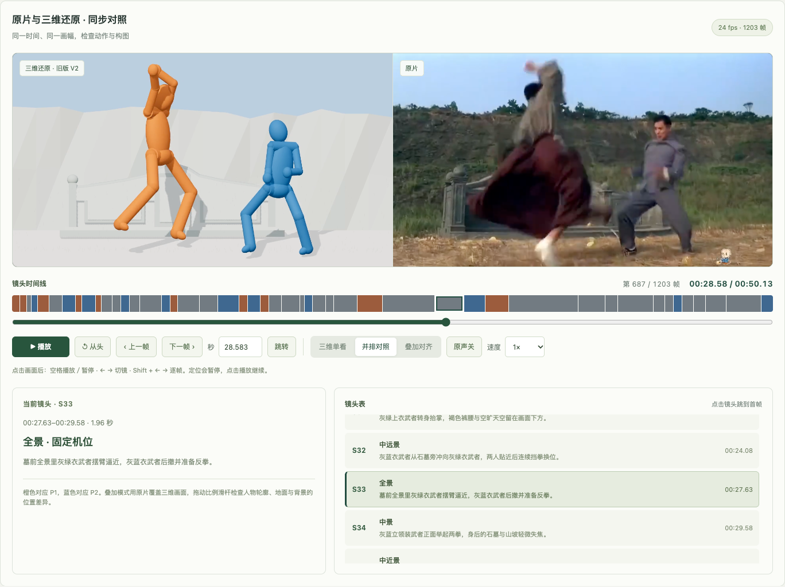
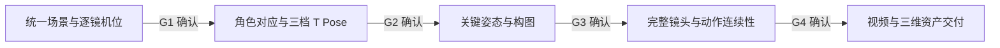

# NexArtMS

**以原视频为参照的 Three.js 白模预演与分阶段审查工作台。**

先确认统一场景，再确认角色、关键姿态和连续动作，最后交付视频与三维资产。NexArtMS 面向构图、角色走位、摄影机和动作衔接的核对，使用白模场景与彩色简化小人表达画面。

目前是基于 **JWM 样片**的本地原型：50.125 秒、24 fps、1,203 帧、47 个镜头、两名主要角色。仓库包含可运行的工作台、五阶段流程演练、原片与三维视频对照、刚性角色技术样例，以及此前 V2 实时预演源码。

> **当前状态：M0 技术试验与 M1 场景阶段进行中。** 五阶段界面可以走通，但正式 G1 场景验收尚未通过；完整动作去抖、正式角色 T Pose 确认和全片三维整包导出仍待实现。当前尚不支持上传任意视频并自动完成还原。



## 快速开始

需要 **Node.js 22.12 或以上版本**和 npm；本项目在 Node.js 22.22.3 上验证。浏览器需要支持 WebGL。

```sh
git clone https://github.com/yaopengcheng11/NexArtMS.git
cd NexArtMS
npm ci
npm run build
npm run serve
```

打开 <http://127.0.0.1:8199/>。服务仅监听本机，终端关闭后服务停止。

| 页面 | 地址 | 用途 |
|---|---|---|
| 正式工作台 | <http://127.0.0.1:8199/> | 查看统一空场景、逐镜对照、保存位置和意见 |
| 五阶段演练 | <http://127.0.0.1:8199/?mode=rehearsal> | 从场景确认走到交付预览，体验每一步的通过操作 |
| 刚性角色试验 | <http://127.0.0.1:8199/?lab=rig> | 查看 CL0／CL1／CL2、合成姿态及 GLB 导出 |

仓库已带样片、参考帧和技术模型。浏览现有样例不需要 API Key、即梦 CLI、姿态检测模型或外部生成服务，也不需要再次抽帧。首次启动会从 `public/project/` 创建本地项目数据。

需要使用其他端口时，例如 macOS／Linux：

```sh
PORT=8200 npm run serve
```

不要直接双击 `index.html`；数据保存、视频读取和页面资源需要通过本地服务访问。

## 五阶段工作流程



| 阶段 | 目标 | 当前可体验内容 |
|---|---|---|
| 1. 场景还原 | 在所有镜头中复用同一场景，先核对背景和机位 | 无角色的固定场景、47 个初步机位、自由观察、俯视、141 张原片首／中／尾参考帧 |
| 2. 角色确认 | 原片身份与三维角色一一对应，确认比例和 T Pose | P1／P2 身份参考与三档合成小人；正式 T Pose 图片尚未制作 |
| 3. 关键姿态 | 先确认逐镜关键帧，再制作完整动作 | 原片与旧版 V2 的 47 张中间帧并排样例 |
| 4. 完整镜头 | 检查连续动作、接触、镜头运动和剪辑节奏 | 原片与 V2 视频同步播放、并排、叠加、逐帧、切镜和倍速 |
| 5. 导出交付 | 导出视频，以及场景、角色、角色动画和相机动画 | 下载现有 V2 MP4 和合成角色 GLB／BLEND／FBX／USD 技术样例 |

### 怎样点击“通过”

在正式工作台底部，点击 **“演练通过 → 角色确认”**，可以假设对当前场景没有意见并进入第二步；也可以从顶部“流程演练”入口开始第一步。

之后使用每一步底部的继续按钮，直到“完成演练”。顶部步骤可回看已经到过的页面；刷新会恢复进度。完整视频对照位于第四步 **“完整镜头 → 连起来看一遍”**。

演练通过记录为 `demo_passed`，保存到独立文件。正式 G1 的“确认场景通过”仍受机位测量条件约束；演练通过不会替代正式验收。

## 场景与角色

### 一个场景，多台摄影机

- 所有镜头复用同一套地形、墓墙、围挡与树木。
- 支持自由旋转、缩放、平移、俯视，以及切换逐镜机位。
- 可修改地物位置、记录意见并保存版本；过期版本写入会被拒绝。
- 当前尺度以约 1.75 米人物身高为暂定参照；机位、纵深与不可见结构仍含估计。

### CL0／CL1／CL2 三档小人

| 档位 | 可见部件 | 表达内容 |
|---|---:|---|
| CL0 | 2 | 头与整体躯干，用于轮廓、重心和大动作沟通 |
| CL1 | 6 | 加入整段四肢，用于行走、转身和基础姿态 |
| CL2 | 27 | 分段四肢、关节和手脚，用于打斗及接触检查 |

技术样例共用 **22 个骨骼／控制节点**。部件随骨骼刚性运动，切换外观保留根位置和姿态；CL1 保持整段肢体长度。导出使用单骨 100% 权重表示，无需人工刷混合权重。

样片的身份约定为：橙色 P1 对应灰绿上衣、褐裤、白鞋角色；蓝色 P2 对应灰蓝衣、黑鞋角色。新流程中的正式角色比例与 T Pose 仍需确认。

## 原片与三维同步对照

第四步采用与项目一致的浅米白、灰绿和深绿界面。支持：

- **并排对照**：左侧三维，右侧原片，使用相同画幅和播放位置。
- **叠加对齐**：原片覆盖在三维画面上，可调整比例和打开三分参考线；0% 看三维，100% 看原片。
- **三维单看**：单独显示三维视频，切换模式保留播放位置。
- **47 镜时间线与镜头表**：随播放高亮，点击镜头跳到首帧。橙色为 P1 单人镜头，蓝色为 P2 单人，灰色为双人或其他镜头。
- **精确定位**：上一帧／下一帧、拖动帧进度、输入秒数、从头查看。
- **回放控制**：0.25×／0.5×／1×／1.5×／2×；只播放原片的一路声音。

| 操作 | 快捷键 |
|---|---|
| 播放／暂停 | 点击画面后按空格 |
| 上一镜／下一镜 | `←`／`→` |
| 上一帧／下一帧 | `Shift + ←`／`Shift + →` |

定位操作会暂停，点击播放继续；输入框内保留正常输入行为。界面帧号从 1 开始，数据帧号从 0 开始。

当前第四步播放的是已导出的 V2 MP4，两路视频共享同步控制器。实时三维与自由视角回放保存在 [`examples/jwm-v2/`](examples/jwm-v2/README.md)。叠加用于观察差异，不会自动修改场景或相机。

## 工程结构

```text
NexArtMS/
├── src/                       # React 页面、Three.js 场景、刚性角色、视频对照
│   ├── main.tsx               # 正式场景工作台
│   ├── Rehearsal.tsx          # 五阶段演练
│   ├── SceneViewport.tsx      # 三维视图与机位切换
│   ├── environment.ts         # 固定场景
│   ├── rig.ts                 # 统一骨架与三档外观
│   ├── VideoComparison.tsx    # 对照播放器
│   └── comparison-clock.ts    # 两路视频同步、定位、缓冲
├── public/
│   ├── project/               # 初始场景与镜头数据
│   ├── reference.mp4          # 原片对照视频
│   ├── reference-frames/      # 141 张精确参考帧
│   ├── demo/                  # V2 视频与 47 张中间帧
│   └── probes/                # 刚性角色与 DCC 格式技术样例
├── server.mjs                 # 本地 HTTP、数据接口、视频分段读取
├── project-store.mjs          # 正式项目保存与版本检查
├── rehearsal-store.mjs        # 独立演练记录与阶段推进
├── scripts/                   # 自动检查、浏览器检查、抽帧和 DCC 试验
├── examples/jwm-v2/           # 旧版实时预演源码与姿态数据
├── docs/                      # 实施方案与执行进度
└── reports/                   # 验证记录和界面截图
```

运行时生成的 `data/`、构建结果 `dist/` 和依赖 `node_modules/` 不纳入版本库。旧版示例的 `examples/jwm-v2/data/` 是重建姿态所需的输入数据，会随源码保存。

### 数据与版本

正式项目保存在 `data/project.json`，历史版本保存在 `data/revisions/`。演练保存在 `data/rehearsal.json` 与 `data/rehearsals/`。前端保存时携带基准版本；正式场景变更后，基于旧版本的演练需要重新开始。

仓库没有携带当前使用者的完成记录。新克隆会从初始场景开始。备份本地工作时需同时保留 `data/`。

## 开发与验证

### 本地开发

先在一个终端启动默认端口 8199 的服务：

```sh
npm ci
npm run serve
```

再在另一个终端启动前端：

```sh
npm run dev
```

打开 <http://127.0.0.1:8198/>。前端的数据接口代理指向 8199；开发时保持后端使用默认端口。

### 自动检查

```sh
npm run check
npm run build
```

当前包含 26 项自动检查，覆盖刚性骨架、固定骨长、单骨权重、姿态等价、保存与版本冲突、正式确认保护、演练顺序与隔离、帧边界及视频同步控制。

### 浏览器检查（可选）

```sh
npx playwright install chromium
BASE_URL=http://127.0.0.1:8199 node scripts/browser-scene-probe.mjs
```

也可通过 `CHROME_PATH` 指定本机 Chrome，或通过 `PLAYWRIGHT_MODULE` 指定 Playwright 模块。浏览器脚本的报告写入 `reports/`。

- `browser-scene-probe.mjs`：场景、参考帧和确认保护；`CHECK_SAVE=1` 会写入测试位置及历史，只用于可丢弃副本。
- `browser-rehearsal-probe.mjs`：从首页走完五阶段并验证下载；必须设置 `BASE_URL` 和 `DISPOSABLE_REHEARSAL=1`，只用于可丢弃副本。
- `browser-comparison-probe.mjs`：两路视频、实际解码帧、模式、快捷键和异常处理；目标需处于演练第四步。
- `browser-probe.mjs`：合成角色与场景技术检查，会重新生成 `public/probes/rig.glb`；更新后需重新执行对应 DCC 验证。

已有记录包括：两路视频定位帧对齐、全部 47 镜的完整回放、浅色界面与小屏布局，以及 Blender 中合成角色 GLB／BLEND／FBX／USD 的局部往返试验。历史实测环境和边界见 [执行进度](docs/progress.md) 与 [验证说明](reports/README.md)。

### 重新抽帧（可选）

这些脚本针对当前 JWM 的 24 fps 与镜头数据，需要 FFmpeg 位于系统 PATH，或设置 `FFMPEG`：

```sh
node scripts/extract-reference-frames.mjs /path/to/source.mov
node scripts/prepare-rehearsal.mjs /path/to/existing-v2.mp4
```

替换输入视频时，必须同时核对镜头边界、帧率、时长、原片预览及三维视频的时间映射。上述命令抽取参考帧；`prepare-rehearsal.mjs` 还会复制并覆盖已有 V2 演练视频，不会自动重建新影片。

## 已知边界与下一步

| 工作 | 状态 |
|---|---|
| 当前 V2 的 720P／24 fps MP4 | 已导出，可播放与下载 |
| 统一场景和 47 个机位初值 | 可查看与保存，仍需标定 |
| 五阶段流程与同步对照 | 可运行、可演练 |
| CL0／CL1／CL2 刚性角色 | 技术样例已验证 |
| 正式 G1 场景确认 | 地标重投影误差与机位测量未完成 |
| 正式角色对应与 T Pose 参考 | 待制作及用户确认 |
| 新流程关键姿态和连续动作 | 待实现；V2 仍有动作抖动 |
| 全片视频与三维资产一键导出 | 待实现；当前提供已有文件下载和技术样例 |
| Maya／Houdini 导入、相机动画交换 | 尚未实测验收 |

下一步优先完成固定场景和机位标定，形成 G1 候选；随后确认正式角色和关键姿态，再进行固定骨长、动作连续性、支撑接触与去抖处理，最后验证整包导出。

## 文档

- [详细实施计划、框架设计与验收标准](docs/implementation-plan.md)
- [当前执行进度与验收边界](docs/progress.md)
- [验证记录说明](reports/README.md)
- [旧版 V2 实时预演](examples/jwm-v2/README.md)
- [样片、参考帧与技术模型说明](docs/assets.md)
