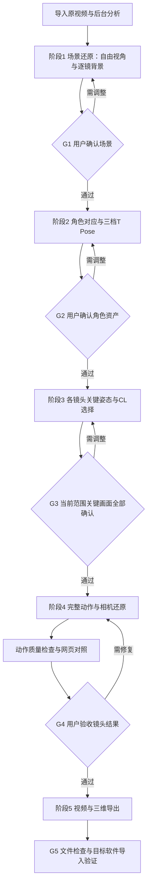
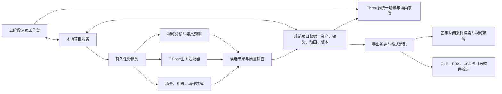

# 视频三维复现：实施计划、框架设计与验收标准

> 版本：1.0\
> 日期：2026-09-24\
> 状态：实施设计稿。产品流程与角色分级依据已确认的讨论；技术选型、接口和量化门槛是本文件提出的实施方案。\
> 首个完整验收项目：`jwm.mov`，单一场景、两名主要角色、47 个镜头、50.125 秒、24 fps、1280 × 720。\
> 本次交付范围：这份方案文档。文中计划功能与验收结果不代表已经实现或通过。

## 阅读导航

- 第 1—3 节：目标、范围、现有基础与五阶段用户流程。
- 第 4—6 节：系统架构、数据契约、版本与确认机制。
- 第 7—10 节：场景、角色、关键姿态和连续动作的实现方法。
- 第 11—12 节：网页展示、视频与三维导出。
- 第 13 节：工作包、依赖、分工、排期方式与迁移策略。
- 第 14—16 节：量化验收、回归用例、最终交付标准。
- 第 17—18 节：风险、待验证问题与参考依据。

---

## 1. 项目目标与已经确定的原则

### 1.1 产品目标

把原视频转化为一个可以审查、分阶段确认、稳定播放并向三维软件交付的白模预演项目，包含：

1. 统一的三维场景资产。
2. 与原片人物对应的角色资产及 CL0、CL1、CL2 三档外观。
3. 各镜头经过确认的关键姿态与摄影机。
4. 连续、稳定、保留原片节奏的角色动画和相机动画。
5. 原片与三维结果的网页对照展示。
6. 视频、场景、角色、动画、相机与镜头时间信息的导出包。

首个目标是在当前打斗视频上完成全部五阶段。方法应能复用于其他单场景、少量人物的视频；多场景影片、复杂人群与写实角色不作为本轮完成条件。

### 1.2 需求总表

| 编号 | 已确定的要求 | 对应阶段／验收 |
|---|---|---|
| R01 | 先还原统一场景，三维画面中不显示角色；支持自由视角及逐镜头背景查看 | 阶段 1／G1 |
| R02 | 用户确认场景后，才能进入角色确认 | 阶段 1→2／G1、SYS |
| R03 | 建立原片角色与三维角色的一对一身份映射，颜色稳定 | 阶段 2／G2 |
| R04 | 展示原片参考、生成的 T Pose 参考图及 CL0／CL1／CL2 三档三维外观 | 阶段 2／G2 |
| R05 | 小人使用刚性关节层级，固定比例与骨长，无需人工刷混合蒙皮权重 | 阶段 2／G2、G4 |
| R06 | 各镜头先还原开始帧／关键帧，用户可做必要调整并确认 | 阶段 3／G3 |
| R07 | 用户选择分镜与镜头的 CL 档位，允许按镜头、按角色覆盖默认值 | 阶段 3—4／G3、G4 |
| R08 | 当前范围内的关键画面全部确认后，才能生成该范围的完整镜头动画；首项目范围为全片 47 镜 | 阶段 3→4／G3、SYS |
| R09 | 镜头内部动作流畅连续，保留击打、起跳、落地等动作特征 | 阶段 4／G4 |
| R10 | 保留并排、叠加、逐帧、跳镜头、自由视角等对照体验 | 阶段 4／VIEW |
| R11 | 一键导出视频，或向 Maya／Blender／Houdini 交付所需三维信息 | 阶段 5／G5 |
| R12 | 每阶段确认绑定到明确版本，前序修改能识别并提示后续结果失效 | 全流程／SYS |

### 1.3 范围与边界

**本轮包含：**场景与角色资产准备、关键姿态纠正、镜头校准、动作连续性、用户确认、网页审查、导出及目标软件导入验证。

**网页内编辑范围：**服务于还原确认的物体位置／尺寸调整、角色根位置与朝向、关键姿态手脚目标、基础摄影机参数、CL 档位选择、撤销与保存。复杂动画曲线编辑、完整绑定工具、材质创作、任意剪辑重编交由外部三维软件完成。

**外观范围：**白模场景、彩色小人、三级外观；不增加第四档，不把 CL2 扩展为写实人物。脸部表情、手指精细表演、衣物模拟与真实服装材质不列入本轮。

**还原边界：**单目剪辑视频不能唯一确定真实尺寸、背面形状和遮挡动作。项目必须区分画面观测、人工确认和合理推断。统一空间、合理接触和可用动画是目标，不宣称获得了真实三维扫描或专业动捕真值。

**视频生成边界：**前述即梦文生视频路线不作为本方案的动画生产主链。生图用于角色 T Pose 参考，最终三维画面由确定性的场景与动画数据渲染。

## 2. 当前 V2 基础与需要替换的部分

### 2.1 本次核实的依据

现有交付位于 `examples/jwm-v2/`。本次读取了 README、验证记录、包版本及关键实现；没有重新运行整个应用的旧验收。

| 当前内容 | 已核实事实 | 本方案中的处理 |
|---|---|---|
| 原片与镜头 | 交付记录为 1203 帧、47 镜、24 fps、50.125 秒；已提供镜头表和预览视频 | 迁移并核对精确帧边界，保留原片时间映射 |
| 角色对应 | A／P1：灰绿上衣、褐裤、白鞋，橙色；B／P2：灰蓝衣、黑鞋，蓝色 | 迁移为稳定角色 ID，保留参考截图与身份校正记录 |
| 原始观测 | 自动二维姿态、人工关键帧和补点数据已经存在 | 作为观测与约束输入，不能直接当成最终三维动画 |
| 模型 | 球体、椭球、圆柱构成的分段小人；肢段按当前两端点距离缩放 | 保留视觉语言，改成固定骨长的刚性骨架 |
| 摄影机 | 原片匹配视图使用固定正交投影 | 改为每镜独立、可校准的相机数据，优先使用透视相机 |
| 场景 | 背景按镜头重建，部分山坡轮廓按帧变化 | 替换为统一场景资产；逐帧轮廓只保留作参考观测 |
| 时间处理 | 主要按 24 fps 整数源帧取姿态，人工关键帧分段线性插值 | 改成连续时间动画求值，保留准确的源帧对照模式 |
| 网页 | 并排、叠加、逐帧、选镜头和自由视角已有基础 | 复用交互设计，接入新数据与五阶段流程 |
| 验证 | 现有脚本检查帧数、切点、投影计算和网格数值有效性 | 保留结构检查，新增空间一致性、动作质量和导入验证 |

现有验证记录包含浏览器回放与有限值检查等历史执行证据，但这些结果不能证明本方案要求的固定场景、固定骨架、动作去抖和跨软件导出已经达标。

### 2.2 当前抖动的已知机制

- 有效检测点直接进入姿态，尚无针对有效序列的时间去噪。
- 缺失点及人工关键帧主要做线性插值，速度在衔接位置可能突变。
- 肢段、躯干长度随关节点变化，误差可能表现成身体伸缩。
- 头部中心与半径使用不同检测点和阈值分支，存在突变机制。
- 深度逐帧推断，可能影响三维遮挡与阴影稳定性。

这些是结构性风险，不等于已量化每个镜头的抖动来源。正交原机位下，沿相机前后方向的位移本身不改变二维投影；不能把所有屏幕抖动归因于深度估计。浏览器掉帧也要与姿态抖动分开测量。

## 3. 五阶段用户流程与确认条件

### 3.1 主流程



后台可以提前做切镜、人物检测和参考帧提取，但不能因此自动通过用户确认，或把未确认资产直接用于正式完整镜头生产。

### 3.2 阶段 1：固定场景

**输入：**视频、镜头表、背景参考帧、静态参照点。

**用户看到：**空场景三维视口、原片对照、镜头列表、自由视角；三维视口不显示角色。选择镜头后进入该镜头的初步摄影机视图，必要时显示首／中／尾三个时刻。

**用户可调整：**主要物体的位置、朝向、尺寸、地面和山坡整体形状；摄影机初步构图。复杂修改也可通过文字要求触发重新生成候选版本。

**输出：**统一场景版本、初步镜头相机、尺度依据、可行走与接触地面、已知／推断区域标记。

**确认条件：**主要物体空间关系成立；47 镜均可查看；同一物体不随切镜变形或移位；用户确认整体场地。此时摄影机仍是初步标定，阶段 3 可进一步精校。

### 3.3 阶段 2：角色与三档 T Pose

**输入：**角色身份清单、原片参考截图、已确认场景尺度。

**用户看到：**每个角色的原片截图、生成的 T Pose 图、CL0／CL1／CL2 三个同步三维预览。可转到侧面和背面，查看可选骨架叠加。

**用户可调整：**角色归属、颜色、身高、头身比例、肩宽、四肢比例。修改比例会生成新的角色资产版本。

**输出：**角色稳定 ID、身份参考、三档外观、统一骨架、固定骨长、绑定初始姿态、生成图的来源记录。

**确认条件：**角色无重复或混淆；三档对应同一人物；CL2 比例与关节位置合理；刚性关节动作检查通过；用户逐角色确认。CL0 没有可见手臂，不能要求其外观出现字母 T；它显示同一 T Pose 的简化结果。

### 3.4 阶段 3：关键姿态

**输入：**已确认的场景、角色，以及每镜的源帧、相机初值和姿态观测。

**用户看到：**原片关键帧与三维构图对照、关键帧列表、角色与相机选择、CL 档位、接触标记。

**关键帧策略：**简单镜头用代表帧；复杂打斗需覆盖起势、击打／接触、腾空最高点、落地或结束姿态。不能只因第一帧相似就认定整段动作已经受到充分约束。

**用户可调整：**角色位置与朝向、手脚目标、支撑侧、身体主要姿态、摄影机机位与焦距。此处提供必要的撤销、重做和保存。

**输出：**相机版本、关键姿态约束、关键事件时刻、接触区间、CL 显示档位、动作细节要求、人工修改层及确认记录。

**确认条件：**所有要求的关键帧通过对应用户确认；关键接触与时机已明确。首项目全部 47 镜完成 G3 后才进入正式全片动作还原。开发用合成测试不属于正式镜头生产。

### 3.5 阶段 4：完整镜头与网页展示

**输入：**G3 确认版本集合、全部源帧观测和接触信息。

**处理：**逐镜求解完整表演与相机运动，检查动作连续性，修复失败项，再按原片剪辑顺序播放。

**用户看到：**当前网页已有的对照方式，以及镜头质量状态、问题时间点和推断区域提示。复杂动作可临时切到 CL2 或隐藏骨架检查。

**输出：**连续动画曲线、逐镜表演片段、摄影机动画、剪辑时间映射、质量报告和已确认版本。

**确认条件：**全帧结构检查、动作指标及逐镜视觉确认通过。正常速度检查动作力度，慢放检查衔接与接触，自由视角检查三维合理性。

### 3.6 阶段 5：导出

**输入：**明确选择的已确认项目版本、镜头范围、导出档位与目标预设。

**用户操作：**选择视频／三维项目、整片／单镜／镜头集合、目标软件、输出目录，然后启动一次导出任务。

**输出：**视频或资产包、镜头清单、导出日志、兼容性说明、检查结果。

**确认条件：**文件结构与数据检查通过；宣称兼容的目标软件完成真实导入、播放和关键帧复核。缺少目标软件验证的预设必须显示“尚未验证”，不得显示“已验证兼容”。

## 4. 系统框架设计

### 4.1 总体架构



核心原则：规范项目数据是唯一空间与动画依据。网页、视频和三维导出读取同一个明确版本。原始观测、生成候选与用户修改分层保存。

### 4.2 建议技术组成

| 层 | 建议组成 | 选择理由与约束 |
|---|---|---|
| 用户界面 | TypeScript、React、Vite；直接调用 Three.js 视口模块 | 五阶段状态、确认和局部调整需要清晰组件边界；现有播放器逻辑可迁移 |
| 三维运行时 | Three.js；首轮沿用当前工程的 `0.186.0` 并锁定版本 | 避免在功能重构中同时改变渲染库；升级另做回归 |
| 项目服务 | Node.js／TypeScript，本地 HTTP API，单项目写入串行化 | 统一保存、确认、任务调度与导出；默认本机使用 |
| 项目存储 | 不可变 JSON 版本文件＋二进制动画／网格文件＋原子更新的项目清单 | 便于审查、迁移和备份；首版不依赖远程数据库 |
| 视频工具 | FFmpeg／ffprobe；准确记录源帧与时间戳 | 解码、参考帧、音频与固定帧序列编码 |
| 观测与求解 | 独立 Python worker；姿态检测与约束求解分模块 | 可替换算法，避免检测模型格式侵入项目主结构 |
| 生图 | 统一 Provider 适配器，记录模型、参数、参考与任务 ID | 不把特定供应商或 Codex 交互工具直接当成产品服务器 API |
| 导出 | GLB 编译器＋目标格式转换 worker＋DCC 导入检查脚本 | 网页运行时不负责所有格式；转换器以规范项目数据为输入 |
| 测试 | 数据与求值单元测试、浏览器流程测试、视频探测、目标软件批处理检查 | 各项分别产生证据，不把一类测试当成另一类验收 |

新增依赖与转换器版本在 M0 技术探针后锁定。生图或检测服务若需要外部账号，单独配置；已有结果的查看和播放不应依赖在线服务。

### 4.3 模块职责

| 模块 | 负责 | 明确的输出 |
|---|---|---|
| `ingest` | 视频元数据、源哈希、切点、时间基准、参考媒体 | `SourceMedia`、`ShotList` |
| `observations` | 身份候选、二维关节、背景参照、遮挡和可信度 | `ObservationSet` |
| `scene-reconstruction` | 统一环境、尺度、地面代理、初步相机 | `SceneAsset`、`CameraCandidate` |
| `character-assets` | 身份、T Pose 图、比例、骨架与三档几何 | `CharacterAsset`、`CharacterLookSet` |
| `keyframe-layout` | 静态构图、姿态约束、接触与用户修改 | `PoseConstraintSet`、`CameraClip` |
| `motion-solve` | 固定骨长的连续表演、遮挡补全、去抖与接触 | `PerformanceClip`、`MotionQualityReport` |
| `timeline` | 镜头编排、源时间与表演时间映射 | `Sequence` |
| `review-workbench` | 展示、局部调整、问题定位和明确确认 | 用户修改与 `ApprovalRecord` |
| `project-store` | 版本、依赖、失效传播、任务结果接收 | `ProjectManifest`、`Revision` |
| `export` | 视频渲染、格式编译、打包与导入检查 | `ExportBundle`、`ExportReport` |

### 4.4 建议代码与项目目录

以下为目标结构示意，不表示这些文件当前已经存在。

```text
apps/
  workbench/              # 五阶段界面
  project-service/        # 本地服务与任务协调
packages/
  project-schema/         # 规范数据、版本、校验
  scene-runtime/          # 固定场景、相机、刚性角色、动画求值
  reconstruction/         # 观测转约束、求解接口
  quality/                # 投影、接触、时间、骨架检查
  export/                 # 视频、GLB、目标格式编译
workers/
  video/                  # 解码、源帧、音频
  pose/                   # 检测与连续姿态求解
  image-provider/         # T Pose参考图
  dcc/                    # Blender/Maya/Houdini适配与验证
tests/
  fixtures/               # 合成骨架、已标注源帧、导出小场景
  integration/
  browser/
  dcc/
project-data/<projectId>/
  source/                 # 原片或引用、哈希与时间映射
  observations/           # 原始检测和参考标注
  revisions/              # 不可变规范数据版本
  assets/                 # 场景、角色、T Pose图
  clips/                  # 表演和相机动画
  approvals/              # 用户确认及依据版本
  jobs/                   # 可恢复任务状态
  reports/                # 自动检查与视觉证据
  exports/                # 按版本生成的交付包
```

## 5. 核心数据契约

### 5.1 单位、坐标与时间

1. 内部统一右手坐标系，Y 轴向上；角色标准正面朝 +Z；摄影机局部观察方向遵循 Three.js 的 -Z。各导出器负责一次明确的轴向转换。
2. 内部长度单位为米。没有真实测量时，以约定的角色身高或已知物体作为尺度锚点，记录 `scaleBasis: assumed`；不能把假定尺寸写成实测尺寸。
3. 旋转存单位四元数 `[x, y, z, w]`；静态关节偏移与绑定姿态独立保存。动画求值不能依赖上一次播放结果。
4. 帧率用有理数 `fpsNumerator/fpsDenominator`，避免长期依赖四舍五入的秒数。
5. 镜头范围统一为 `[startFrame, endFrameExclusive)`。首项目源帧范围为 `[0,1203)`；最后一帧索引是 1202，时间边界是 50.125 秒。
6. 分开记录源媒体时间、镜头局部时间、表演片段时间和剪辑时间。原片可能有重复动作和跳接，不能把全片强行解释为一段连续真实表演。
7. 遇到可变帧率视频时保留每帧 PTS。分析代理可标准化帧率，但必须保存代理帧到原帧的映射。
8. 场景资产和人体骨长不允许随镜头重新缩放。全项目尺度调整属于显式版本变更。

### 5.2 数据实体

| 实体 | 最小必需字段 | 关键约束 |
|---|---|---|
| `ProjectManifest` | `id, schemaVersion, currentRevision, sourceRef, stageStates, dependencyRefs` | 不在此内嵌另一套可随意改写的空间数据 |
| `SourceMedia` | `id, hash, width, height, frameCount, fps, ptsMap, proxyRef, audioRef` | 原片不可被代理视频覆盖；参考帧可追溯 |
| `Shot` | `id, sourceRange, sceneRef, cameraRef, actorInstances, keyframeRefs` | 使用整数边界或明确 PTS，拒绝重叠／遗漏的意外区间 |
| `SceneAsset` | `id, revision, nodes, units, scaleAnchor, groundProxy, evidenceRefs` | 静态节点变换不随镜头和时间变化 |
| `CharacterIdentity` | `id, label, color, referenceImages, appearanceNotes` | 不按画面左右位置命名或重新分配 |
| `CharacterAsset` | `identityRef, revision, proportions, rigRef, lookRefs, tPoseRef` | 三档共享比例参数与稳定关节命名 |
| `RigDefinition` | `jointIds, parentIds, restLocalTransforms, limits, attachmentFrames, contactMarkers` | 无循环；固定骨长；明确模型部件到关节的归属 |
| `ObservationSet` | `sourceFrame, identityRef, jointId, uv, confidence, visibility, provenance` | 可见、遮挡、离画分开；无观测不等于零坐标 |
| `PoseConstraint` | `shotRef, frame, actorRef, jointTargets, rootTarget, contactRefs, strength, provenance` | 用户锁定值不能被求解器静默覆盖 |
| `PerformanceClip` | `id, revision, rigRef, timeRange, rootTracks, rotationTracks, contactTrack, evidenceLevel` | 不包含用伸缩身体匹配画面的骨段 scale 曲线 |
| `CameraClip` | `id, revision, poseTracks, projection, lensTracks, filmback, principalPoint, crop, filmFit, aspect, clipping, sourceRange` | 保存焦距与成像面尺寸，或等价完整投影参数；偏心、裁切与画幅适配显式记录 |
| `ShotActorSetting` | `actorRef, lookLevel, requiredMotionDetail, solvedChannels, visibilityTrack` | 显示档位与已还原动作细节分开记录 |
| `Sequence` | `shotInstances, sequenceRanges, clipTimeMaps, cameraBindings, fps` | 保存切镜语义，不仅是一条变换曲线 |
| `ApprovalRecord` | `stage, scope, artifactRefs, dependencyHash, reviewer, decision, time, reportRefs` | 确认绑定版本；任务完成不产生用户确认 |
| `QualityReport` | `ruleVersion, artifactRefs, metricResults, sampleCounts, exclusions, evidenceRefs` | 指标、未测项和豁免项分别记录 |
| `ExportBundle` | `projectRevision, presetVersion, files, checksums, conversionMap, reportRef` | 不能混入不同版本的资产与动画 |

### 5.3 档位与动作细节分离示例

```json
{
  "shotId": "S30",
  "actorId": "P1",
  "characterRevision": "character-P1-r3",
  "lookLevel": "CL2",
  "requiredMotionDetail": "articulated-contact",
  "performanceRef": "performance-S30-P1-r5",
  "solvedChannels": ["root", "torso", "head", "arms", "legs", "hands", "feet"],
  "contactRefs": ["contact-S30-support-hand"],
  "approvalState": "pending"
}
```

这是契约示例，不代表 S30 当前已有这些新资产。对于文戏，`requiredMotionDetail` 可以是 `root-torso-head`；升档时检查缺失通道并要求补还原，不能把默认 T Pose 手脚冒充已复现动作。

## 6. 状态、确认与失效传播

### 6.1 状态机

阶段／资产状态建议为：`not_started → working → ready_for_review → approved`，同时支持 `needs_changes`、`stale`、`failed`。任务执行状态另外保存，避免把“计算成功”和“用户确认”混在一起。

必须遵守：

- 只有明确的用户确认操作能写入 `approved`。
- 自动检查不通过时，显示失败明细，不能自动进入下一阶段。
- 确认请求必须携带所见版本及依赖摘要；版本已变化时拒绝旧确认并提示重新查看。
- 后台旧任务完成时，只能保存为旧版本候选，不能覆盖更新后的项目当前版本。
- 用户确认后再次修改，生成新版本；原始结果与原确认记录保留。
- “暂不确认”和“跳过问题”不是通过。确需接受例外时，记录范围、理由与影响，并在汇总中单列。

### 6.2 失效规则

| 变更 | 保留有效的部分 | 需要重新检查／确认的部分 |
|---|---|---|
| 静态场景物体位置、地面形状 | 未依赖该物体的角色身份和 T Pose | 受影响相机、关键姿态、接触、动画与导出 |
| 全局尺度锚点 | 身份与原片参考 | 场景、角色尺寸、接触、相机、全部量纲相关报告 |
| 角色比例或骨架 | 场景、源视频、身份参考 | 该角色三档资产、关键姿态、动画、接触与导出 |
| 角色颜色／标签 | 骨架与运动求解 | 外观确认、视觉预览、包含外观的导出；纯动作数值检查可复用 |
| 镜头摄影机 | 固定场景和角色资产 | 该镜投影检查、关键画面确认；若参与姿态求解则该镜动画也失效 |
| 用户关键姿态或接触 | 其他镜头及未依赖的资产 | 该表演片段及引用它的镜头、动画检查、相关导出 |
| CL 显示档位 | 已存在的完整运动数据 | 当前镜头视觉确认和外观导出；升档缺运动通道时触发补还原 |
| 导出预设 | 还原和用户确认 | 该格式导出与兼容性验证 |

依赖关系按实际引用传播，避免一个颜色变更触发全片动作重算，也避免骨长变化后继续使用旧动画报告。

### 6.3 最小服务接口设计

| 接口示意 | 用途 | 必需保护 |
|---|---|---|
| `POST /projects` | 创建项目与登记源视频 | 源哈希、路径校验 |
| `POST /projects/:id/jobs` | 启动分析／候选生成／求解 | `inputRevision`、幂等键、任务类型 |
| `GET /projects/:id/jobs/:jobId` | 查看进度、失败原因、输出 | 不触发重复生成 |
| `POST /projects/:id/revisions` | 保存用户修改 | `baseRevision` 校验，原子提交 |
| `POST /projects/:id/approvals` | 确认阶段／资产／镜头 | 当前依赖摘要、范围、明确用户操作 |
| `POST /projects/:id/exports` | 导出指定版本 | 精确版本、范围、预设及依赖检查 |
| `GET /projects/:id/reports/:reportId` | 查看验收证据 | 报告与版本关联 |

任务支持取消和有界重试。程序重启后能恢复状态；外部生成任务优先查询已保存任务 ID，避免重启后重复提交和重复计费。第一版只承诺单用户本地项目写入，不把该设计解释为已具备多人云端协作。

## 7. 场景与相机还原设计

### 7.1 场景制作顺序

1. 选取能看到主要地物的多镜参考，建立墓墙、坡顶、地面转折等参照点对应。
2. 确定统一坐标、尺度假设、主要活动区域及地面代理。
3. 创建主要建筑与地形的粗白模，不制作草叶、裂缝等表面细节。
4. 配置各镜相机初值，以背景参照点联合调整场景比例和相机。
5. 以多个机位交叉检查同一物体；遮挡区域标记为推断。
6. 将结果交给 G1 用户审查，冻结场景版本。

不能只凭某一个镜头把场景精细建完，再用逐镜移动墙体的方法补偿摄影机误差。无足够背景信息的特写镜头应记录相机不确定性，并参考相邻镜头及动作关系。

### 7.2 精度优先级

- 一级：打斗地面的高低、支撑面、主要墙体位置与尺寸、人物可活动空间。
- 二级：墓墙和山坡轮廓、厚度、转角、遮挡关系。
- 三级：草、细小石块等辅助形体；不影响前两级时再补充。

模型面数不是核心验收项。以 720P 最近使用机位下的轮廓质量、跨镜空间一致性和实际运行性能判断是否足够。

### 7.3 相机契约

每镜独立保存世界位姿、投影类型、焦距／视场角、成像比例和随时间变化的参数。透视相机保存“焦距＋成像面宽高”，或等价的完整投影参数；同时记录主点／film offset、数字裁切与 film-fit 规则。主链使用透视相机；只有源画面或特定用途确需正交投影时才显式启用。

阶段 1 的相机用于空场景检查；阶段 3 联合人物关键姿态精校；阶段 4 补齐镜头内部运镜。后两步不允许暗中改动已确认静态场景。

源片可能存在数字裁切、镜头畸变、稳定处理或速度变化。发现这些情况时保存对应画幅／时间映射，不能用人物骨长变化掩盖。

## 8. 角色资产、CL 分级与刚性绑定

### 8.1 三级外观规范

| 档位 | 可见结构 | 主要表达能力 | 验收重点 |
|---|---|---|---|
| CL0 | 头＋整体躯干；约 2 个主要几何部件 | 根位置、朝向、重心、头部方向、人物关系 | 身份、位置、比例基准、朝向 |
| CL1 | 头、躯干、四条整段肢体；约 6 个主要部件 | 基础姿态、简单行走和手势概况 | 大体动作与肢体方向 |
| CL2 | 分段四肢、关节与手脚等末梢；参考图约 27 个主要部件 | 屈肘屈膝、打斗、撑地、踢腿与接触 | 全身姿态、关节、支撑和接触 |

2／6／27 是外观部件参考，不等于骨骼数量，也不是为了凑数量拆分网格的硬指标。CL2 使用当前小人的简洁视觉语言。

三个档位共享人物颜色、比例参数、角色 ID、骨架命名和动作时间。低档显示是对高维姿态的简化表达，不保证所有末梢位置或轮廓与 CL2 完全重合。档位由用户选择，首版不按摄影距离自动切换。

**CL1 特别约束：**一根整段刚性手臂无法同时表达屈肘与准确手部接触。首版采用固定长度、从肩／髋表达主要肢体方向的折叠规则；不通过逐帧伸缩整肢追逐手脚端点。接触动作使用 CL2 审查。

### 8.2 统一骨架建议

采用稳定的人形语义层级，建议起步为 22 个控制／关节节点，包含角色根节点；这不是要求 CL2 必须显示 22 个几何体。

```text
root
└─ pelvis
   ├─ spine
   │  └─ chest
   │     ├─ neck → head
   │     ├─ shoulder_L → upperArm_L → forearm_L → hand_L
   │     └─ shoulder_R → upperArm_R → forearm_R → hand_R
   ├─ thigh_L → shin_L → foot_L → toe_L
   └─ thigh_R → shin_R → foot_R → toe_R
```

根节点是整体运动参照，不是要求始终贴地的接触点。身体高度变化由整体移动及关节姿态共同产生；脚底、手掌接触使用独立标记和几何代理。

固定骨长依据初始关节偏移；运行时主要改变根位移和各关节旋转。必要的辅助节点应注明用途，不能用它们规避人体骨长约束。

### 8.3 刚性绑定实现

网页中使用 `Bone`／`Object3D` 关节层级，每个独立几何部件固定附着在一个关节的局部坐标下。旋转关节时子部件随父级运动，几何体本身不进行柔性拉伸。Three.js 支持这样的层级与关键帧动画结构。[Bone 文档](https://threejs.org/docs/pages/Bone.html)、[动画系统文档](https://threejs.org/manual/pages/animation-system.html)

绑定规则：

- 几何体的关节中心、朝向与偏移在资产构建时确定。
- 部件几何尺寸与骨长在 T Pose 确认后固定。
- 肘、膝、肩、髋等处可使用球形关节遮挡缝隙。
- 手使用简化拳／掌，脚具有明确脚底与前后方向。
- 不增加每个顶点多骨混合的手工权重制作流程。
- 若导出格式要求标准 skin，编译时可自动生成单骨 100% 权重，保持刚性效果。

关节限位与手脚目标求解需要单独实现或适配；不能把 Three.js 具备骨骼结构理解为已经提供了完整角色绑定编辑器和所有接触求解能力。

### 8.4 T Pose 图生成与确认

1. 从原片选择能稳定识别人物的截图，保留源帧号。
2. 生成统一画幅、完整身体、清楚轮廓的 T Pose 参考图，保持主要体型和服装识别线索。
3. 展示原片截图与生成图，标记原片看不到的推断部分。
4. 以同一比例参数构建三档模型；三维视口同步方向与显示尺度。
5. 用户确认角色身份、比例与档位外观；保存图像来源、模型参数和确认版本。

生成失败、参考人物混淆或肢体异常时，该角色保持待处理。可以重新生成或由用户提供合格参考图；不能用未检查的生成图自动替代原片证据。

### 8.5 档位选择与升降档

- 全片默认档位可以设置；镜头可覆盖；镜头中的每个角色也可覆盖。
- 普通切档只改变显示，不改变规范动画。
- 同一镜头首版使用稳定档位，不在播放中无提示跳档。
- 低档完成的动作若缺少高档所需通道，升档显示“待补充动作”，进入补求解和确认。
- 原本已有完整动作的镜头，降档不会删除肘膝、手脚与接触数据。
- 导出默认包含用户选择的外观和已有规范骨架动画；“导出全部三档”作为选项，避免三套模型同时叠在角色身上。

## 9. 关键姿态与最小调整工具

### 9.1 关键姿态记录

每条关键姿态至少包含镜头、源帧、角色、根变换、关节目标、摄影机、接触信息、锁定强度和来源。

用户明确确认的姿态设为硬约束或带明确容差的高优先级约束。自动估计姿态作为软约束；二者不能只用同一个 confidence 数值混为一谈。

### 9.2 最小工具集

| 工具 | 功能 | 范围限制 |
|---|---|---|
| 角色根变换 | 平移、转向 | 固定身高与比例，不在镜头里单独缩放人物 |
| 手脚目标 | 拖动末梢，肘膝跟随 | 附带弯曲方向控制，保留固定骨长 |
| 躯干与头部 | 调整倾斜、扭转和朝向 | 提供关节限位与重置 |
| 接触标记 | 指定支撑手／脚、接触对象和时间区间 | 区分固定、滑动、腾空与击打 |
| 相机调整 | 位置、朝向、焦距、恢复参考 | 自由观察相机和正式镜头相机分开 |
| 对照与保存 | 叠加、逐帧、撤销、重做、保存候选、确认 | 保存到修改层，不能直接改原始检测 |

该工具集服务于还原验收，不扩展为完整三维动画制作软件。

## 10. 连续动作与去抖设计

### 10.1 求解管线

```text
原始二维观测与人工参考
    ↓ 身份、可见性、异常点检查
关键姿态＋事件时间＋接触区间
    ↓ 固定角色骨架与已确认场景
镜头内根运动／关节旋转初解
    ↓ 时间约束、限位、接触与投影联合优化
连续动画曲线
    ↓ 原机位、自由视角、动作指标检查
修正后的PerformanceClip
    ↓ 确定性求值与导出采样
网页／视频／三维资产包
```

### 10.2 分层保存

- **观测层：**检测结果、人工源帧标注、置信度、遮挡状态，保持可追溯。
- **约束层：**确认的关键姿态、时机、支撑、接触和关节限位。
- **表演层：**世界根轨迹与骨骼旋转曲线。
- **修改层：**用户纠正及适用区间，优先级明确。
- **展示层：**CL 折叠规则与渲染选择。

避免把逐帧二维坐标直接作为渲染器每帧重新捏身体的指令。

### 10.3 去抖与约束策略

1. **异常观测清理。**先修复身份交换、左右肢体误配和明显离群点；不能平滑错误身份。
2. **有界缺失处理。**短缺失结合前后帧补齐，长遮挡使用完整身体约束和事件信息求解；标记推断区间，不无限线性补点后视作观测。
3. **固定骨长。**求解关节旋转和根运动，不通过每帧缩放肢段满足像素位置。
4. **时间稳定。**对整段或重叠窗口联合求解；窗口接缝应检查位置及非冲击区间速度连续性。
5. **旋转连续。**处理四元数正负号等价性，以适合旋转的插值与优化方式处理，不直接逐分量平均后当作有效姿态。
6. **支撑与接触。**以脚底／手掌几何接触点建立约束；滑步允许沿接触面移动，腾空阶段解除落地锁定。
7. **动作特征保护。**保留起跳、最高点、踢击、撞击、急停和落地的姿态及时间；这些区间允许更高加速度。
8. **相机与表演协调。**在冻结资产的前提下有限次交替优化相机与表演；相机改动使对应 G3 确认失效，重新审查后才能发布结果。

实现时可组合投影误差、时间变化、接触误差与姿态先验作为优化目标，但必须按单位归一化。固定骨长和用户锁定约束不应仅靠一个很小的惩罚权重“尽量满足”。具体求解器与权重通过技术探针比较后锁定。

### 10.4 遮挡、特写与画外身体

正式角色始终拥有完整骨架。原片只看到一只脚时，仍保存其所属角色、完整身体的合理估计以及不确定性；摄影机裁切负责决定可见部分。

不能用删除躯干、缺失骨骼或重造临时脚模型来绕过三维一致性。对确实无法可靠确定的画外姿态，允许采用保守推断并标记，但不得声称已精确复现。

### 10.5 不跨切镜平滑

每镜或明确连续的表演片段分别求解。原片中的重复动作、时间省略和不同拍摄条次可对应不同 `PerformanceClip`。镜头连接使用剪辑规则，不要求所有镜头组成一条物理连续的表演。

### 10.6 两种播放采样

- **原片对照：**准确落在源帧采样时刻，用于逐帧误差和切点检查。
- **连续预览：**按实际播放时间求值连续动画，改善交互观感。

两种模式在同一整数源帧时刻必须得到相同姿态。提高显示帧率不算动作去抖完成；先证明动画数据稳定，再检查浏览器是否掉帧。

## 11. 网页展示与交互验收设计

### 11.1 工作台布局

顶部显示五阶段及状态；左侧显示当前阶段的资产／角色／镜头清单；中间为三维与原片对照；右侧为必要参数、问题与确认操作；底部按阶段显示关键帧或播放时间轴。

状态文字面向用户：待处理、生成中、待确认、需调整、已确认、因前序修改待复核。算法、模型调用日志和数值诊断放在可展开的详细信息内。

### 11.2 保留并完善的能力

- 等画幅、等显示尺寸的原片与三维并排。
- 使用同一原片播放源的透明叠加，避免两个播放器漂移。
- 前后帧、指定帧、指定时间、镜头跳转。
- 自由观察视角与正式镜头视角独立；恢复按钮不改写正式相机。
- 正常速度、慢放和当前镜头循环。
- 按问题跳转：身份、抖动、接触、遮挡、相机和未确认项。
- 切换 CL 时保持角色、时间和摄影机；缺失细节通道明确提示。
- 持久保存与重启恢复；生成期间不阻塞对已有结果的浏览。

### 11.3 性能边界

验收记录必须注明设备、浏览器、分辨率、角色数量、CL 档位、阴影设置与数据版本。首项目以 720P、两名 CL2 角色为基准。

拟定性能目标：预热后连续预览中位帧率至少 30 fps；渲染帧耗时 P95 不高于 50 ms。该目标在指定基准设备上冻结，不能用不同机器上的历史结果代替。离线视频导出不以实时帧率为准，必须逐帧确定性输出。

## 12. 视频与三维导出设计

### 12.1 导出面板

用户选择：导出类型、镜头范围、项目版本、目标软件预设、CL 档位、是否携带参考媒体与音频、输出位置。点击一次后由任务服务执行，界面显示准备、渲染／转换、验证、打包及失败原因。

默认不把原始大视频和生成服务凭据打进三维包；参考媒体由用户选项决定。已批准版本可以重复导出，导出期间的后续修改不会混入正在导出的快照。

### 12.2 格式与交付矩阵

| 交付目标 | 建议格式／路径 | 必须保留 | 限制与适配 |
|---|---|---|---|
| 视频审片 | MP4，固定帧序列编码；首项目 1280×720、24 fps | 全部镜头、正确时间、可选原声 | 不使用实时屏幕录制作为正式逐帧输出 |
| 通用三维交换 | GLB＋项目清单 | 网格、材质颜色、骨架、根与关节动画、相机位姿 | 动态镜头参数、切镜和其他核心格式不支持的语义由清单与适配器处理 |
| Blender | GLB 导入适配；可通过 Blender worker 构建 `.blend` | 分组资产、角色骨架、动作、镜头相机、时间轴 | `.blend` 需要实际 Blender 构建与打开验证 |
| Maya | FBX＋镜头清单＋Maya 导入脚本 | 关节、刚性模型、烘焙动画、相机及镜头时间 | 使用明确版本转换器；原生控制器不是默认交付内容 |
| Houdini | USD／UsdSkel＋镜头清单＋Houdini 导入适配 | 场景层级、骨架动画、相机与采样时间 | 明确 units、upAxis、timeCodesPerSecond，验证目标版本支持 |

Three.js 的 GLTFExporter 支持场景、网格、骨架、动画和相机相关导出，但不等于一份 GLB 能完整表达本项目的剪辑和所有镜头参数。[GLTFExporter 文档](https://threejs.org/docs/pages/GLTFExporter.html)

通用 GLB 首版以标准变换／骨骼通道为主。动态焦距／视场角、显隐、切镜绑定与约束元数据应进入规范清单；不得假设目标软件自动识别它们。转换适配器应从规范项目数据直接读取这些信息，不能只拿一份可能已经丢失信息的 GLB 继续转格式。核心 glTF 的动画目标与 skin/joints 语义应按正式规范检查。[glTF 2.0 规范](https://github.com/KhronosGroup/glTF/blob/main/specification/2.0/Specification.adoc)

### 12.3 刚性角色的导出语义

提供两种明确的交付表示：

1. **刚性对象层级：**独立几何部件＋层级变换动画，适合保持视觉结果。
2. **标准骨架资产：**关节、rest／bind pose、刚性几何体与单骨 100% 绑定，适合目标软件识别角色骨架。

用户选择角色动画导出时，默认提供第二种表示；不能只导出一组空节点便宣称已交付可用骨架。单骨绑定自动生成，不要求人工刷权重。

导出资产范围由用户所选清单确定，不能直接等同于当前视口的可见物体。应检查隐藏骨架、画外人物和被切换掉的外观是否需要导出；特别防止导出器的默认“仅可见对象”选项漏掉所需数据。

网页内接触求解的结果要烘焙为可播放曲线。约束说明可另存，但不默认承诺 IK 控制器、求解器和全部约束跨软件原样复现。

### 12.4 动画与时间组织

- 角色资产单独保存，稳定 ID 不随镜头改变。
- 每镜／表演条次使用清楚命名的动画片段，避免 47 镜动作全部互相覆盖。
- 包含镜头局部帧、源帧、剪辑帧和必要的偏移映射。
- DCC 若采用从第 1 帧开始的时间轴，转换器记录从内部第 0 帧开始的偏移。
- 不依赖目标软件自动识别多片段剪辑；导入脚本负责建立时间范围、相机绑定和动作引用。
- 导出采样间隔默认 1 个源帧；接触与高速动作需要更密采样时，记录采样率并检查插值结果。
- 硬切前后不插值混合表演。需要拼接到一条时间轴时，切点使用明确的离散切换语义。

### 12.5 导出包结构示意

```text
export_<project>_<revision>/
  manifest.json                 # 单位、轴、帧率、角色、镜头与版本
  scene/                        # 固定场景
  characters/P1/                # 身份、选定外观、骨架与初始姿态
  characters/P2/
  shots/S01/                    # 该镜表演、相机和必要的源时间映射
  shots/...
  sequence/                     # 镜头编排与相机绑定
  importers/                    # 对应目标软件的导入辅助
  reports/                      # 格式校验、数值比对、导入报告
  previews/                     # 关键画面或短预览
  README.md                     # 打开方式、兼容版本、已知限制
  checksums.json
```

### 12.6 视频输出与可重复性

按固定源时间逐帧求值，输出帧序列后编码；视频长度、镜头边界和音频时间独立探测。首项目整片应输出 1203 帧，不能以播放结束回调推断帧数正确。

相同项目版本、参数和工具版本下，规范动画及导出数值应在规定容差内一致。视频编码时间戳和容器元数据可能导致文件字节不同；不能把整个视频二进制哈希相同作为跨平台确定性的唯一标准。

## 13. 分阶段实施计划

### 13.1 实施策略

保留当前 V2 作为原片对照基线，提取可复用的播放器、数据与人工校正。新结构先做小规模技术探针，再按产品阶段推进。没有通过探针前，不直接批量重做全部 47 镜。

技术探针允许使用合成动作和离线研究候选；正式项目仍严格遵守 G1→G2→G3→G4 的用户确认顺序。

### 13.2 工作包与完成定义

| 里程碑 | 工作包 | 主要产物 | 依赖 | 完成定义 | 初始工程估算 |
|---|---|---|---|---|---|
| M0 基线与技术探针 | 固定输入与镜头边界；规范数据草案；22 节点刚性小人；三档切换；最小 GLB／FBX／USD 可行性实验；拟定指标标定 | 基线报告、Schema v1 草案、探针结果、依赖版本表 | 当前素材与可用运行环境 | 识别最关键算法和导出风险；不把未验证格式标绿 | 2—4 人日 |
| M1 项目骨架与场景阶段 | 项目服务、版本与任务状态、五阶段壳、固定场景、地面代理、初步相机、空场景逐镜查看 | 可运行阶段 1、场景候选与 G1 记录 | M0 | 所有镜头可查看同一空场景，G1 流程通过 | 5—8 人日 |
| M2 角色阶段 | 身份清单、参考提取、生图适配、三档资产、刚性绑定、T Pose 并排确认 | 两角色三档资产、统一骨架、G2 记录 | M1 的尺度契约；正式确认依赖 G1 | 两角色身份、比例、三档及绑定通过 | 4—6 人日 |
| M3 关键姿态阶段 | 镜头工作台、关键帧选择、根／手脚／相机调整、接触标记、保存撤销与确认 | 关键姿态工具、相机精校、G3 记录 | M2；正式制作依赖 G2 | 47 镜所需关键画面确认，修改可持久保存 | 5—8 人日 |
| M4 连续动作核心 | 身份／异常处理、固定骨长求解、时间去噪、接触约束、事件保护、动画求值、质量报告 | 连续表演与相机动画、动作回归工具 | M3、G3；场景与角色版本冻结 | 代表难镜先通过，再覆盖全片；G4 动作指标通过 | 10—18 人日 |
| M5 完整网页展示 | 新动画接入并排／叠加／逐帧、问题定位、连续预览、性能与恢复 | 完整五阶段工作台及全片对照 | M4；部分界面工作可与 M3/M4 并行 | VIEW、SYS 检查及逐镜用户审查通过 | 3—5 人日 |
| M6 导出链路 | 视频逐帧输出、资产分包、标准骨架、GLB、Blender、FBX/Maya、USD/Houdini 适配与导入验证 | 导出面板、目标软件包、G5 报告 | M0 导出探针；正式数据依赖 M4/M5 | 每个承诺预设完成实际导入检查 | 7—12 人日 |
| M7 全片验收与交付 | 全部镜头回归、重启恢复、失败重试、版本失效、文档与示例包 | 验收总表、可运行项目、三维和视频样例 | M1—M6 | 第 16 节完成清单通过，无未披露阻塞项 | 3—5 人日 |

**估算说明：**以上合计约 39—66 工程人日，是初始范围估算，不是承诺工期；不含用户等待和不可控外部服务等待。场景／相机／关键姿态的人工制作工时必须在 M0 用代表镜头实测后单独计入。不能在这些制作工作尚未计入时，对外给出完整日历交付日期。

首轮选 6—8 个代表性镜头测量每类制作耗时，再按全片镜头分类估算剩余工作。记录初始制作、返修和用户确认轮次三个时间项，不能只统计算法运行时间。

### 13.3 三条可并行的工作流

| 工作流 | 主要职责 | 依赖与协作边界 |
|---|---|---|
| A：项目与界面 | 阶段状态、确认、版本、工作台、播放器、任务进度 | 依赖统一 Schema；不直接改求解器内部数据 |
| B：三维与动作 | 场景、相机、角色刚性绑定、关键姿态、连续求解 | 输出规范资产与动画；不绕过确认机制发布结果 |
| C：质量与导出 | 指标脚本、代表夹具、格式编译、DCC 导入、回归证据 | 从 M0 开始验证骨架与时间契约；不等全片做完才检查可导出性 |

技术美术／制作人员负责场景与关键姿态判断；算法与三维工程负责求解；用户负责产品定义中的画面确认。小团队可以一人兼任，但产物与检查责任仍分别记录。

### 13.4 关键依赖链

```text
时间／坐标／版本契约
    → 场景与尺度确认
    → 角色骨架及比例确认
    → 关键姿态与接触确认
    → 连续动作求解与去抖
    → 全片展示验收
    → 各目标软件完整导出验收
```

M0 的最小导出实验可提前并行，正式导出使用后续已确认数据。T Pose 生图不能阻止已完成资产的查看；生成失败的角色仍不能自动通过 G2。

### 13.5 现有文件迁移表

| 现有数据／模块 | 保留方式 | 必须改变的部分 |
|---|---|---|
| `shots.json`、`src/shots.js` | 导入源镜头表，核对并转为精确帧边界 | 消除两处可独立修改的镜头事实来源 |
| `data/raw.json` | 原样保存为原始观测与追溯依据 | 不继续直接驱动最终角色几何 |
| `source-layout.json`、`extra-overrides.json` | 导入人工源帧约束与身份校正 | 区分人工证据、三维关键姿态和最终动画 |
| `src/pose-data.json` | 作为 V2 基线和候选初值 | 不作为新的标准骨架动作格式 |
| `background-data.json` | 保留为背景轮廓观测 | 不再每帧改写最终地形 |
| `src/scene.js` | 复用白模视觉、灯光和部件生成经验 | 拆出固定场景、相机、刚性角色、确定性求值 |
| `src/main.js` | 复用播放器及并排／叠加交互 | 接入阶段状态和规范项目数据 |
| 原有验证脚本 | 作为最低结构与数值检查 | 新增质量指标，明确它们不验证真实动作精度 |

旧工程保持可运行，迁移脚本可重复执行且不覆盖人工新修改。新旧数据均带版本号，不能混用 V2 的逐镜尺度与新骨架的米制变换。

## 14. 验收标准与计量规则

### 14.1 验收状态与证据要求

每个验收项只能为：`未执行`、`通过`、`失败`、`因依赖不可用未验证`、`有依据的不适用`、`经确认接受的例外`。未执行不等于通过；不适用与接受例外也不改写为通过。不适用必须记录规则、范围及确认依据。

本节数值是**拟定的 v1 门槛**，不是当前 V2 实测结果。M0 在固定代表样本上验证可测性并冻结门槛与脚本版本；调整门槛需说明依据，不能为迁就某次失败而静默放宽。

每份报告包含：数据版本、工具版本、环境、规则版本、样本数、统计范围、排除项及理由、结果、可查看的证据。人工确认另附确认人、时间及所见版本。

### 14.2 统一计量口径

- 图像误差统一换算到 1280×720 参考画幅；其他画幅等比例换算。
- `H` 表示角色在标准 T Pose 下的约定站立身高；三维误差以 H 归一化。绝对尺度是假定时，应明确写“相对模型尺度”。
- 关键点真值来自独立人工核对的源帧样本；不能用输入检测器的点同时充当唯一验收真值。
- 投影指标仅统计确认可见且能够定位的点；部分遮挡另列，完全遮挡不计入“正确投影样本”。困难片段不得无理由删除。
- 按镜头、角色和景别分别报告；全片平均值不能掩盖单镜严重错误。
- 连续性和抖动统计不跨切点。撞击、急停、滑动等事件区间在检查前明确，避免事后任意剔除失败片段。
- 关键帧确认样本与独立验收样本分开；每镜至少检查首／中／尾及所有重要事件的邻近帧。

**按动作细节确定适用范围：**

| G3 已确认的动作细节 | 必须检查 | 可以有依据地不适用 |
|---|---|---|
| `root-torso-head` | 身份、完整骨架结构、根／躯干／头部运动、对应可见点投影、连续性与已确认事件 | 未要求还原的手脚表演精度；必须标明这些通道未复现 |
| `gross-limbs` | 上述全部，加主要肢体方向、走位和已要求的落脚事件 | 未要求的屈肘细节、手部精确接触；CL1 不用于证明末梢接触精度 |
| `articulated-contact` | 完整关节动作、拳脚投影、关键事件及实际存在的支撑／双人接触 | 仅在该镜确实没有对应事件时，相关接触项可不适用 |

首个打斗项目按 `articulated-contact` 处理动作镜头。适用性由 `requiredMotionDetail`、`solvedChannels` 和确认过的事件决定；仅改变 `lookLevel` 不能降低检查要求。修改动作细节要求必须产生新的 G3 版本和确认。固定骨架、合法数值与导出完整性始终检查。

### 14.3 G0：输入与数据基础

| ID | 检查 | 通过条件 |
|---|---|---|
| IN-01 | 输入追溯 | 原片哈希、元数据、代理映射完整；原片未被覆盖 |
| IN-02 | 首项目时间 | 1203 个源帧映射完整，47 镜覆盖完整时间范围，无意外重叠／缺口 |
| IN-03 | 切点边界 | 每个切点前一帧归前镜，切点帧归后镜；包括已校正 S08 的第 98 源帧 |
| IN-04 | 单位与轴 | 同一测试点经坐标转换与逆变换后满足数值容差，无镜像、重复单位换算 |
| IN-05 | 非法数据 | 缺失引用、重复 ID、NaN、无穷值、层级循环被拒绝并指出位置 |

### 14.4 G1：场景与初步相机

| ID | 检查 | 通过条件 |
|---|---|---|
| SC-01 | 固定场景 | 同一场景版本的静态节点和几何在全部镜头／采样时刻哈希或规范值一致；相机切换不改场景 |
| SC-02 | 无角色阶段 | 阶段 1 的三维视口不渲染角色；切镜和自由观察均成立 |
| SC-03 | 可查看范围 | 47 镜均可查看背景，能自由观察并恢复正式镜头视图 |
| SC-04 | 背景构图 | 在可定位静态参照点样本上，初定投影误差中位数 ≤ 10 px、P95 ≤ 24 px；报告不足以标定的镜头 |
| SC-05 | 空间合理性 | 至少选择三个有共同地物的不同机位交叉检查；地面、墙体、坡顶关系由用户确认 |
| SC-06 | 推断标记 | 尺度依据、不可见区域和相机不确定项有记录；不能把推断值标成实测 |
| SC-07 | G1 确认 | 所需报告与场景候选版本匹配，明确用户确认后才解锁 G2 |

SC-04 的数值不能单独证明真实空间已恢复；必须与 SC-01、SC-05 和用户审查共同通过。

### 14.5 G2：角色、CL 与刚性绑定

| ID | 检查 | 通过条件 |
|---|---|---|
| CH-01 | 身份对应 | 首项目明确两角色；参考截图、颜色和稳定 ID 一致；镜头换边不换身份 |
| CH-02 | T Pose 对照 | 原片参考、生成图与三档模型可同时比较；生成图缺陷可退回修改 |
| CH-03 | 三级完整性 | 每角色仅提供 CL0／CL1／CL2 三档；共用比例与命名；CL0 无肢体的展示含义明确 |
| CH-04 | 刚性变换 | 合成屈肘、屈膝、转肩测试中部件长度与几何不变，关节连接成立 |
| CH-05 | 固定骨架 | 关节父子关系无循环；bind／rest pose 完整；所有必需语义关节存在 |
| CH-06 | 切档一致 | 同一时刻切档前后角色根、标准比例、动画时间不变；允许低档舍弃局部姿态细节 |
| CH-07 | 升档缺失 | 仅完成低档通道时，升档不会宣称完整动作已还原，明确列出待补内容 |
| CH-08 | G2 确认 | 两角色三档与比例逐一确认，记录资产及场景尺度版本 |

### 14.6 G3：关键姿态与必要调整

| ID | 检查 | 通过条件 |
|---|---|---|
| KF-01 | 关键帧覆盖 | 每镜都有代表帧；复杂动作覆盖必要事件，不能存在未说明的关键动作空白 |
| KF-02 | 可见姿态 | 关键拳脚末梢的可定位投影误差初定 ≤ 12 px；身体朝向、支撑侧、角色关系正确 |
| KF-03 | 事件时间 | 起跳、最高点、接触、落地等确认时刻存为准确源帧，不只保存模糊文字 |
| KF-04 | 用户调整 | 根、手脚目标、相机、CL 和接触可调整；保存、撤销、重启后结果一致 |
| KF-05 | 锁定保留 | 后续求解不能静默移动已确认关键约束；无法同时满足时报告冲突 |
| KF-06 | 确认门 | 首项目 47 镜必需关键画面均经用户确认，才允许启动正式全片完整动作生成 |

### 14.7 G4：动作准确性、连续性与去抖

| ID | 指标 | 拟定通过条件 | 适用范围与证据 |
|---|---|---|---|
| MO-01 | 身份与数值 | 无身份交换、骨架缺失、NaN／Infinity | 全镜头、全采样帧，含遮挡与画外骨架 |
| MO-02 | 固定骨长 | 每个受约束骨段 `abs(L(t)-L0)/H ≤ 0.0001`；无动画骨段缩放 | 完整骨架；辅助根节点单独说明 |
| MO-03 | 可见点投影 | 独立样本误差中位数 ≤ 10 px、P95 ≤ 24 px | 每镜／每角色报告，遮挡分组；小目标与难定位样本单列 |
| MO-04 | 关键事件时机 | 与确认参考偏差 ≤ 1 个源帧 | 起跳、最高点、击打、落地、急停等可确认事件 |
| MO-05 | 关键姿态保持 | 已锁定三维位置在约束容差内；事件末梢投影 ≤ 12 px，姿态／支撑侧正确 | 比较 G3 版本及其邻近源帧 |
| MO-06 | 固定支撑漂移 | 一个非滑动接触区间内，脚底／手掌接触点相对目标的最大位移 ≤ 1% H | 用真实接触标记，不能用踝／腕中心替代 |
| MO-07 | 地面穿透 | 接触几何对地面代理的穿透深度 ≤ 0.3% H | 检查脚底、支撑手及倒地关键部位；腾空不得错误锁地 |
| MO-08 | 双人接触 | 明确接触区间的指定代理表面间隙 ≤ 1.5% H，无明显穿越 | 身体表面与接触代理，不能只量两个关节中心距离 |
| MO-09 | 曲线连续 | 镜内位置、旋转无非事件跳变；普通关键帧接缝无突兀速度折点 | 切镜排除；撞击允许速度突变，位置仍连续 |
| MO-10 | 静稳段抖动 | 主要关节角度残差 RMS ≤ 1.5°，根位移残差 RMS ≤ 0.3% H | 使用预先确认的 0.5—1 秒静稳窗，去一次线性缓慢趋势；旋转先转连续局部旋转量 |
| MO-11 | 动作力度保护 | 原片与结果正常速度并排审查通过；击打时刻与关键幅度满足 MO-04／05 | 禁止以低抖动指标交换明显的出拳变软、腾空削平或落地延迟 |
| MO-12 | 求值一致 | 对同一时刻反复跳转、正反顺序求值结果一致，位置差 ≤ 0.00001 H、旋转角差 ≤ 0.001° | 不依赖前一帧状态；对照和连续预览的共同采样点一致 |
| MO-13 | 推断可追溯 | 长遮挡／画外身体有来源与不确定性记录 | 推断段不计为实测准确率，仍做完整骨架合理性检查 |
| MO-14 | 动态区间异常振荡 | 对非冲击运动区间检测角速度／角加速度异常、短时反复变向和根轨迹振荡；无未解决或未说明的异常 | 在角色局部关节与世界根轨迹上计算，分离摄影机运动；输出具体时间点及原片对照 |

MO-09 初期采用曲线边界差分检查和可定位异常报告：在非事件接缝左右取同等微小时间步，比较位置／旋转极限与左右速度。数值阈值在 M0 结合动画曲线尺度冻结；在阈值冻结前，该项仍需人工逐问题复核，不能自动标绿。

MO-10 只评价本来应当稳定的区间；不能用于处罚挥拳、撞击或源片真实震颤。若某镜没有足够长的静稳段，记录“不适用”与原因，并由 MO-09、关键事件、接触和视觉审查覆盖其连续性。

MO-14 用于补足“曲线连续但在运动中高频摆动”的情况。检测窗口、幅度与速度阈值在 M0 用代表动作和干净／注噪夹具冻结：例如给正常运动叠加 2°、6 Hz 的肩部扰动，必须能定位并阻止通过；真实击打与急停应由预先标注的事件规则解释，不能一律当噪声抹掉。无静稳段的打斗镜头仍必须执行 MO-14；报告不能只因接缝连续就把动态去抖标为通过。

### 14.8 VIEW：网页展示与时间同步

| ID | 检查 | 通过条件 |
|---|---|---|
| VW-01 | 画幅与对照 | 原片与三维无拉伸，同画幅同显示尺寸；叠加可检查位置 |
| VW-02 | 帧同步 | 暂停／逐帧时源帧与三维采样帧完全对应；播放无累积时间漂移，呈现偏差不超过 1 源帧 |
| VW-03 | 切镜 | 所有切点前后逐帧正确，无前镜人物残留或跨镜混合 |
| VW-04 | 自由观察 | 自由相机不改变正式镜头、场景、角色或动画；恢复后投影一致 |
| VW-05 | 性能 | 固定基准设备、720P、两 CL2 角色下满足第 11.3 节目标；掉帧与动作抖动分别报告 |
| VW-06 | 完整回放 | 全片正常速度和慢放可播放到结束，末帧与时长正确，无未处理运行错误 |

### 14.9 G5：导出与目标软件验证

| ID | 检查 | 通过条件 |
|---|---|---|
| EX-01 | 导出快照 | 所有文件、资产、动画、报告来自同一项目版本；导出期间改项目不污染结果 |
| EX-02 | 视频 | 首项目 1280×720、24 fps、1203 帧；镜头切点正确；音频启用时首尾同步误差 ≤ 1 源帧 |
| EX-03 | 资产完整 | 场景、角色、骨架、角色动画、相机动画和镜头清单无缺失；路径可移植 |
| EX-04 | 骨架语义 | 在目标软件中能识别关节层级与绑定初始姿态；角色动画可独立播放；手动旋转一个关节时部件刚性跟随，撤销后恢复 |
| EX-05 | 导入变换 | 转回内部坐标后，采样位置误差 ≤ 0.1% H、旋转角误差 ≤ 0.1°；世界朝向与尺度无镜像或倍数错误 |
| EX-06 | 相机构图 | 已确认测试点经导入相机投影后，与导出前差异 ≤ 2 px；夹具覆盖偏心／裁切画幅、film-fit 与动态焦距，至少检查三个时刻 |
| EX-07 | 动作与事件 | 帧偏移、角色、动作片段、切镜绑定正确；事件偏差 ≤ 1 源帧，接触仍满足相关门槛 |
| EX-08 | 目标软件验证 | Blender、Maya、Houdini 分别记录软件版本、实际导入、关键截图、播放及数据比对；保存工程、关闭重开后动画与相机仍正确 |
| EX-09 | 缺失能力处理 | 不支持的参数或依赖明确报告；不得静默丢动画、焦距、角色或时间轴 |
| EX-10 | 可重复与恢复 | 同版本重复导出的规范数值在容差内一致；取消、失败和重试不混包、不误标成功 |

缺少任一目标软件环境时，可以完成该格式的结构检查，但该目标的软件兼容验收保持“未验证”。本轮完整目标包括三种目标软件；不能以其中一种通过代替全部通过。

### 14.10 SYS：阶段、版本与恢复

| ID | 检查 | 通过条件 |
|---|---|---|
| SY-01 | 阶段约束 | 绕过界面直接调用生成／确认接口也无法跳过前置确认 |
| SY-02 | 版本保护 | 旧页面确认、旧任务结果、旧导出请求不会覆盖新版本 |
| SY-03 | 失效传播 | 场景、骨长、关键姿态和 CL 变更按第 6.2 节影响范围更新状态 |
| SY-04 | 保存恢复 | 正常退出和任务中断后重开，资产、确认和任务状态可恢复 |
| SY-05 | 幂等与失败 | 同一请求重试不会重复创建资产或重复提交外部生成；失败留有原因和可重试范围 |
| SY-06 | 数据安全 | 原片和原始观测不被覆盖；重建生成物不覆盖用户修改层 |
| SY-07 | 证据一致 | 每个“通过”可定位到对应版本和证据；未测项、失败项和例外在汇总可见 |

## 15. 首项目回归样本与测试执行顺序

### 15.1 代表镜头

以下根据当前交付说明选择，开始实施时再次与原片核对事件帧。它们是重点样本，不替代全片 47 镜验收。

| 镜头／场景 | 主要风险 | 必须保存的证据 |
|---|---|---|
| S05／S24 腾空与飞踢 | 高点削平、腿部伸缩、落地时机 | 原机位与侧面短片、事件表、脚轨迹 |
| S12 局部遮挡与格挡 | 来脚误认头部、身份和遮挡补点 | 原片骨架叠加、身份／可见性记录 |
| S15 倒地与离画 | 离画残影、画外身体缺失、地面关系 | 关键帧、完整骨架自由视角、显隐时间 |
| S25 后仰翻滚 | 头脚方向错误、翻转连续性 | 连续旋转曲线、关键帧、侧面回放 |
| S26 双人身份 | 切镜后人物交换 | 两角色身份标记、切点前后截图 |
| S28 横翻／S30 单手支撑 | 旋转翻转、撑手漂移、穿地 | 支撑点误差、地面距离、正常及慢放 |
| S37 遮挡头部 | 头部跳变、长遮挡姿态不合理 | 可见性时间带、头部轨迹、自由视角 |
| S42／S43 高踢腿 | 末梢位置不准、击打变软、跨镜误插值 | 事件邻帧、拳脚轨迹、切镜检查 |
| 稳定站姿／持势样本 | 高频抖动、头部大小变化 | 预先标定静稳区间、残差曲线、正常速度短片 |
| 合成三档与导出夹具 | 档位切换、骨架语义、单位与相机转换 | 三档同时间截图、目标软件导入报告 |

### 15.2 测试执行顺序

1. **数据与求值单元检查：**时间边界、骨架层级、固定骨长、四元数、单位、CL 折叠、确定性求值。
2. **任务和确认集成检查：**旧版本确认、失败重试、任务中断、依赖失效、用户修改保护。
3. **阶段浏览器检查：**从导入到 G1／G2／G3 的真实界面操作，保存并重启。
4. **代表镜头动作检查：**先处理上述高风险镜头，冻结指标与参数后扩展全片。
5. **全片检查：**全部帧做结构检查，全部镜头做关键样本与正常速度审查；问题镜逐帧返修。
6. **导出检查：**最小夹具先验证语义，再用首项目的难镜，最后整片；各目标软件分别执行。
7. **最终回归：**同一候选版本上复核关键用户流程与交付包，不以旧版本截图替代。

测试只围绕实际风险与阶段门。已经充分覆盖且没有相关改动的检查可引用同版本证据，不为追求测试数量反复执行无关项目。

### 15.3 单项验收记录模板

```text
验收项：MO-06 支撑漂移
项目／版本：
场景／角色／动画版本：
镜头／角色／源帧范围：
规则版本与门槛：
有效样本数、遮挡与排除说明：
测量结果：
自动检查状态：未执行／通过／失败
视觉确认状态：未执行／通过／需调整
证据文件：
问题与修复版本：
检查人／时间：
```

## 16. 最终交付与完成定义

### 16.1 项目交付物

- 可运行的五阶段网页工作台与本地服务。
- 首项目原始输入引用、镜头表和时间映射。
- 一个统一场景、两名角色、每角色 CL0／CL1／CL2 资产及 T Pose 对照。
- 统一刚性骨架、固定比例、角色身份表。
- 47 镜经过确认的关键姿态、相机、连续角色动画和剪辑编排。
- 全片网页对照与 720P 视频。
- GLB 通用包，以及 Blender／Maya／Houdini 目标预设对应的导出包与导入适配。
- 自动检查、逐镜视觉确认、目标软件导入报告、已知限制与使用说明。

### 16.2 完成检查清单

- [ ] G1：统一空场景经用户确认，47 镜可查看。
- [ ] G2：角色身份、T Pose、三档外观、刚性绑定经用户确认。
- [ ] G3：所有镜头必要关键画面和事件已确认，调整可持久保存。
- [ ] G4：全片动作、接触与去抖通过检查，用户看过正常速度结果。
- [ ] VIEW：并排、叠加、逐帧、选镜头、自由视角及时间同步通过。
- [ ] SYS：版本、失效传播、恢复、幂等与用户修改保护通过。
- [ ] G5：视频帧数和时间正确；三维包完整；三个目标软件分别实际导入验证。
- [ ] 所有未通过、未验证与接受例外均明确列出；不存在用总体通过掩盖阻塞项。
- [ ] 最终产物、用户确认、自动报告与导入证据对应同一发布候选版本。

**整体完成条件：**以上必要项全部达到约定状态，并在用户实际消费的网页和目标软件中完成检查。只有实现代码、生成文件或通过数值有限性检查，都不足以宣布整个项目完成。

## 17. 风险、技术探针与待冻结事项

| 风险／问题 | 影响 | 首次处理时机 | 处理方式 |
|---|---|---|---|
| 单目深度与尺度歧义 | 原机位接近但自由视角失真 | M0／M1 | 多镜地物约束、尺度假设、接触验证、明确推断范围 |
| 场景和相机互相补偿 | 逐镜看似正确但空间不统一 | M1 | 固定场景版本、跨镜参照、相机参数边界 |
| T Pose 图体型漂移 | 三维角色依据错误参考构建 | M2 | 原片截图共同对照、人工确认、保留生成来源 |
| CL1 无法表达弯曲接触 | 低档对照产生误解 | M2／M3 | 明确折叠规则，接触审查使用 CL2 |
| 低档动作升级为高档 | 缺失细节被误认为已还原 | M3 | 分开记录 look 与 solvedChannels，升档补算并确认 |
| 过度平滑 | 打击变软、落地延迟 | M4 | 事件保护、接触约束、正常速度审查 |
| 复杂遮挡与双人接触 | 自动结果不稳定，人工成本增加 | M0／M4 | 先跑代表难镜，记录补帧与返修耗时，设置问题定位工具 |
| 刚性部件裂缝或穿插 | 三维观看不自然 | M2 | 关节中心校正、球形连接、合理比例和活动范围 |
| 文件导出丢相机／切镜语义 | DCC 中构图与时间错误 | M0／M6 | 规范清单直接驱动适配，逐项能力矩阵和动态镜头夹具 |
| 缺少 Maya／Houdini 或插件版本不匹配 | 无法完成对应软件验收 | M0 | 先列环境清单；缺失项标未验证，安排真实环境检查 |
| 长任务重试或旧结果覆盖 | 重复生成、成本或版本错乱 | M1 | 持久任务 ID、幂等、输入版本检查、候选隔离 |
| 全片手工制作工时未估计 | 排期严重偏差 | M0 | 按镜头类型实测制作／返修耗时，再计算全片预算 |

### 17.1 M0 必须给出答案的事项

1. 单场景多镜相机与地物约束，能否在不变形场景的前提下达到可接受构图。
2. 刚性小人骨架与三档折叠规则，能否稳定表达当前所需动作。
3. 固定骨长＋时间稳定＋接触约束的代表难镜效果，与 V2 的投影贴合度差多少。
4. 各项量化指标是否有可靠样本、脚本和单位；哪些阈值需要在试点后调整。
5. GLB、FBX、USD 的骨架、相机和时间语义是否能通过选定转换器完整传递。
6. 实际可用的目标软件、图像 Provider、检测与求解运行环境及版本。
7. 人工场景、相机、关键姿态及接触制作的实际工作量。

这些探针用于减少实现风险，不替代产品流程中的用户确认。未满足条件时，应调整算法、补充人工约束或报告限制，不能把低质量结果直接批量扩展到全片。

## 18. 参考依据与使用说明

### 18.1 需求与本地依据

- 本任务中已经确认的五阶段流程、三级外观、刚性绑定、关键姿态调整范围、动作流畅性与三维导出要求。
- 用户提供的 CL0／CL1／CL2 分级图；本文件第 8 节已用文字完整记录其相关定义，阅读不依赖临时剪贴板图片路径。
- 当前交付的 `README.md`、`验证记录.md`、`src/scene.js`、`src/choreography.js`、姿态构建与验证脚本。源码核实用于判断迁移范围，历史验证记录未在本轮全部重跑。

### 18.2 技术参考

- [Three.js Bone](https://threejs.org/docs/pages/Bone.html)：关节层级基础。
- [Three.js Object3D](https://threejs.org/docs/pages/Object3D.html)：对象层级与变换。
- [Three.js Animation System](https://threejs.org/manual/pages/animation-system.html)：动画片段、轨道与播放。
- [Three.js GLTFExporter](https://threejs.org/docs/pages/GLTFExporter.html)：GLB 导出能力与选项。
- [glTF 2.0 Specification](https://github.com/KhronosGroup/glTF/blob/main/specification/2.0/Specification.adoc)：标准动画通道与 skin/joints 语义。
- [OpenUSD UsdSkel](https://openusd.org/release/api/usd_skel_page_front.html)：USD 骨架、绑定与关节动画模式。
- [Maya FBX Export options](https://help.autodesk.com/cloudhelp/2022/ENU/Maya-Basics/files/GUID-FE8DBEAA-C2DD-43B3-9933-4BA4CDDEAA89.htm)：动画烘焙和相机等交换选项；具体目标版本另行验收。
- [Houdini UsdSkel Animation Import](https://www.sidefx.com/docs/houdini/nodes/sop/kinefx--usdanimimport.html)：USD 骨架动画导入能力。

公开文档证明底层能力存在，不证明当前工程已经完成对应功能。所有“兼容”“流畅”“准确”“一键完成”的产品结论，均以本文件约定的实际验收证据为准。
